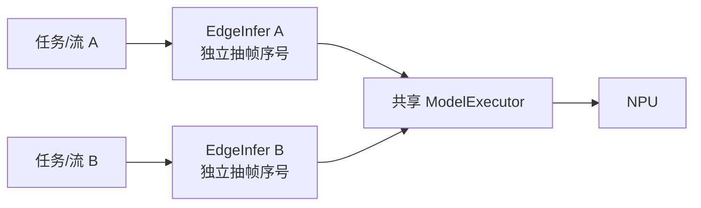
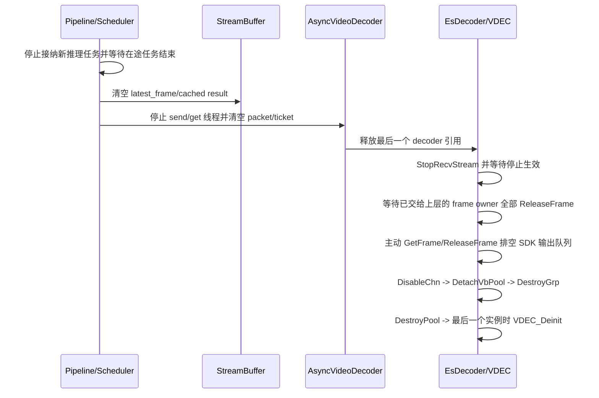

# media_agent 抽帧、算法统计与 VDEC 生命周期优化及长稳测试记录

## 1. 任务范围与当前结论

本轮依据《开发板多任务并发资源异常排查与恢复记录》和《开发板 VPS 恢复与多任务并发异常根因修复复测记录》的建议，对 `media_agent` 及其 `third_party/algorithm/eic7700Infer` 完成以下调整：

1. 前处理入口增加按任务、按流独立的抽帧控制，配置格式与 `pipeline_20260630` 的 `EsPreProcess.interval` 对齐；
2. 将前处理、NPU 推理、后处理、跟踪和事件判断五个阶段的吞吐及平均耗时加入周期统计；
3. 补齐 VDEC 上层帧、SDK 输出队列、VDEC group 和用户 VB 池的完整销毁顺序；
4. 增加仅用于压力场景隔离的 `enable_alarm_artifacts`、`enable_stream_publish`、`enable_alarm_report` 三个开关，将本进程录像/快照、AI 流发布和平台告警副作用分别隔离；
5. 已确认不同任务引用相同内容的 pkg 时共享同一个进程级 `ModelExecutor`，并非每个任务重复加载模型；
6. 已在 92 服务器完成 `SDK_VERSION=202606` RISC-V 交叉编译安装，在 127 开发板完成 10 路冒烟、抽帧、模型共享、统计和 VDEC 退出回基线验证；
7. 按最新要求，每类压力场景的单轮上限调整为 3 小时，并优先执行“事件录像/快照落盘”完整功能场景；任一轮中途故障后不得累计故障前时长，修复后必须从零重新计满 3 小时，见第 9 节。

本轮没有修改开发板系统文件，没有卸载驱动或重启开发板。

## 2. 抽帧设计

### 2.1 配置格式

`third_party/algorithm/config/EsInfer.yaml` 新增：

```yaml
preprocess:
  # [input, output]
  interval: [1, 1]
```

语义与官方 `pipeline_20260630/case/od/config/EsPreProcess.yaml` 保持一致：

- `[1,1]`：每帧进入模型；
- `[2,1]`：每 2 帧均匀保留 1 帧；
- `[4,1]`：每 4 帧均匀保留 1 帧；
- 必须满足 `input > 0`、`output > 0` 且 `output <= input`，非法值回退为 `[1,1]`。

长稳测试使用 `[4,1]`。源码默认仍为 `[1,1]`，避免升级后无意改变现网推理频率。

### 2.2 为什么不能在共享模型执行器中做全局抽帧

当前一个任务对应一路流，每个任务创建自己的 `AlgoDetector/EdgeInfer`，但相同模型会绑定到同一个进程级 `ModelExecutor`。如果把抽帧计数放在共享执行器中，多个流会共同竞争一个序号：高帧率流可能消耗绝大多数保留位置，低帧率流可能长期得不到推理机会。

因此抽帧计数放在每个 `EdgeInfer` 实例中，并使用原子序号保证并发安全：



抽掉的帧返回 `RET_SKIPPED`，它与 `RET_FAILURE` 严格区分。上层对抽掉的帧执行以下动作：

- 正常完成 scheduler task；
- 尽快释放当前 VDEC 帧；
- 不缓存空检测结果；
- 不调用跟踪和事件状态机；
- 不记录 `EdgeInfer infer failed`；
- 计入 `sampled_out` 统计。

这避免了把抽帧误解释为“目标消失”或推理失败。

## 3. 相同模型是否共享

结论：当前架构已经实现跨任务共享，键不是路径字符串，而是模型内容摘要与运行时签名。

共享链路如下：

1. `build_model_key()` 对整个 pkg 文件计算 SHA-256；
2. `ModelKey = package_digest + runtime_signature`，当前运行时签名为 `eic7700:embedded-device:dma`；
3. 进程级 `ModelService` 使用 `unordered_map<string, weak_ptr<ModelExecutor>>` 保存执行器注册表；
4. 新任务调用 `acquire()` 时，如果同一键的执行器仍存活，直接返回已有 `shared_ptr`；
5. 同一个任务内多个事件若引用相同 pkg，也会先按 ModelKey 去重，只执行一次模型，再按 `source_aliases` 将结果路由给多个事件；
6. 所有任务释放后，注册表中的弱引用过期，模型执行器才销毁。

板端 10 路冒烟实测只出现两个 `model executor created`：

- `hardhat-detection_eic7700_1_4.pkg`；
- `area-intrusion_eic7700_1_4.pkg`。

后续任务日志均为 `model executor reused`，最终保持 `process_live_models=2`。这证明 10 个任务没有重复加载 10 份相同模型。

需要注意：共享的是模型、NPU context/stream、VPS/NPU/后处理执行 lane；每路任务自己的过滤条件、跟踪器和事件状态仍保持隔离。

## 4. 为什么单模型可达 140 FPS，而多任务 NPU 不一定达到 100%

“140 FPS”与“NPU 100%”不是同一个指标。前者通常是固定输入、单模型连续提交时的峰值吞吐，后者是监控窗口内 NPU 真正忙碌时间的占比。当前多任务完整路径中存在以下空隙和约束。

### 4.1 NPU 前后还有串行或受保护阶段

完整一次模型执行包含：

```text
VDEC 帧取得
  -> VPS resize/letterbox/normalization
  -> NPU prepare/submit/wait/report/unprepare
  -> CPU 或 DSP 后处理
  -> 按任务过滤
  -> 跟踪
  -> 事件判断
  -> 可选录像、快照、推流、日志和 IPC
```

NPU 在 VPS 前处理、DSP/CPU 后处理、跟踪、事件处理和磁盘等待期间并不忙。

### 4.2 当前并发保护有明确上限

- 每个唯一模型只有一个 `ModelExecutor` worker，保证同一模型 runtime 的线程亲和及顺序；
- `Eic7700Infer::run()` 自身有 `run_mutex_`；
- 同一 NPU device 的 `DeviceRunLimiter` 默认 `EIC7700_NPU_MAX_INFLIGHT=1`；
- VPS 操作有进程级 `vps_operation_mutex()`；
- DSP 后处理有进程级 `dsp_execution_mutex()`；
- `num_infer_threads=3` 只代表上层最多三个任务并行，不等于同一 NPU 上有三个无约束并发任务。

这些保护是为避免当前 EIC7700 SDK 在无界并发下发生 context、VPS、DSP 或 DMA buffer 竞争，不能简单删除以追求监控值 100%。如需提高 `EIC7700_NPU_MAX_INFLIGHT`，必须按 1、2、3 等值逐级验证正确性和 DMA-BUF 平台期，不能直接设到线程数或 8。

### 4.3 输入供给和抽帧会主动降低 NPU duty cycle

本轮 `[4,1]` 冒烟中，10 路输入约 250 FPS，但周期统计为：

| 指标 | 实测值 |
|---|---:|
| 解码 | 250.0 FPS |
| 完成跟踪/事件的帧 | 34.8 FPS |
| 模型执行 | 48.2 次/秒 |
| 正常抽掉 | 103.8 FPS |
| 平均 VPS 前处理 | 2.413 ms/模型 |
| 平均 NPU 段 | 10.044 ms/模型 |
| 平均后处理 | 2.479 ms/模型 |

部分任务同一帧包含两个不同模型，因此模型执行次数高于事件帧数。抽帧后模型供给约 48 次/秒，当然不足以让理论服务能力约 100 次/秒的 NPU 一直满载。

同一冒烟窗口的 `es_hw_watcher` 连续窗口显示：

```text
NPU Usage 约 57%～61%，NPU Framerate 约 79～84
VDEC Usage 约 41%，VDEC Framerate 约 288～291
```

这是主动抽帧后的合理结果，不是硬件异常。判断异常必须同时观察应用 `recv/dec/infer`、`/proc/esmap/dec` 增量和多个 watcher 窗口，不能以单次 NPU 未到 100% 判定故障。

## 5. 五阶段统计

`FrameInferenceResult/ModelResult` 现在携带以下数据：

- 每个成功模型的 `preprocess_ms`；
- 每个成功模型的 `inference_ms`；
- 每个成功模型的 `postprocess_ms`；
- 每个任务帧的 `track_ms`；
- 每个任务帧的 `event_ms`；
- 本帧实际执行的模型数量；
- `processed` 与 `sampled_out` 状态。

`Statistics` 每个配置周期输出：

```text
[AlgoStat] preprocess=.../s npu_infer=.../s postprocess=.../s
           track=.../s event=.../s sampled_out=.../s
           avg_ms(pre/npu/post/track/event)=.../.../.../.../...
```

其中前处理/NPU/后处理的 FPS 是“模型操作数/秒”；跟踪/事件的 FPS 是“任务帧数/秒”。多模型任务中两类数值不同是正常现象。

## 6. VDEC 帧生命周期修复

### 6.1 修复后的所有权

`ES_VDEC_GetFrame()` 成功后，`VIDEO_FRAME_INFO_S` 被封装为 RAII owner。最后一个 owner 析构时调用且只调用一次 `ES_VDEC_ReleaseFrame()`。`DecodedVideoFrame` 同时保留对应 decoder 的 `shared_ptr`，保证上层仍持有 DMA 帧时 VDEC group 和用户 VB 池不会先析构。

流停止时的顺序为：



旧实现遗漏的是“排空已经解码、但 get 线程停止前尚未取出的 SDK 输出帧”。这些帧不计入上层 `inflight`，却仍持有用户 VB 块和 DMA-BUF。

如果 `DestroyGrp` 失败，新代码不会继续错误地复用 group id 或销毁仍被该 group 使用的 VB pool，而是隔离该 group 并保留模块引用。正常路径应始终销毁成功；出现 `teardown quarantined` 必须视为严重故障并采集现场。

### 6.2 冒烟退出验证

10 路任务停止时：

- 10 个 group 的上层 `inflight=0`；
- 10 个 group 的 `release_failures=0`；
- 输出排空后 `left_pics=0`；
- 10 次 `ES_VDEC_DestroyGrp succeeded`；
- 最后执行 `global ES_VDEC_Deinit ret=0x0`；
- `/proc/esmap/dec` group 数从 10 回到 0；
- DMA-BUF 从运行期约 224 个对象、655835136 字节，回到 2 个对象、7340032 字节；
- 未出现 `ES_VDEC_ReleaseFrame failed`、`teardown timed out`、`DestroyPool failed` 或 `quarantined`。

## 7. 压力场景隔离开关

主配置新增：

```yaml
pipeline:
  enable_alarm_artifacts: true
  enable_stream_publish: true
  enable_alarm_report: true
```

- `enable_alarm_artifacts`：控制本进程的事件录像和快照文件生成；
- `enable_stream_publish`：控制 AI 绘制流向本地 MediaServer 发布；
- `enable_alarm_report`：控制事件通过 IPC 上报平台并写入平台事件数据库；
- 三项均为 `true` 时是生产行为；三项均为 `false` 时仍完整执行解码、抽帧、前处理、NPU、后处理、跟踪和事件状态机，但不再产生可触发外部写盘的输出。

三个开关默认均为 `true`，不会改变升级后的生产行为。最初只关闭 `enable_alarm_artifacts` 后，AI 流仍被平台 NVR 录制；继续关闭推流后，告警 IPC 仍会触发平台数据库及磁盘回收。因而严格的“只推理”基线必须同时关闭三个开关，不能只以 Recorder/Snapshotter 是否出现来判断隔离完成。

## 8. 构建、部署与冒烟证据

92 交叉编译命令在 `cross-proj-p550:202606` 容器中执行：

```bash
cd /workspace/proj/media-agent
SDK_VERSION=202606 \
./scripts/build.sh --target riscv64 --jobs 16 --install
```

构建通过。板端最终关键产物：

```text
media_agent                    SHA256 2388e7b8d149d3aab85310b1a6c3830678aa21e70c209e48f41b7b2f87bb1e3e
libcdky_eic7700_infer.so       SHA256 5f89bcad763a2351149d1f6622ef06c868639e0142acc616f6f160683c486f52
config/EsInfer.yaml（安装默认 [1,1]） SHA256 7c6855657b51a77e35b8cb8ad39bf75271134f9c75e52c47fc2100df83b12552
config/EsInfer.yaml（板端长测 [4,1]） SHA256 ba6da6791b04b2d0e44e3c92d69c23d14ce4de07a9c7326bf64d72ee7fae9c31
```

部署前备份：

```text
/home/ubuntu/workspace/test/media_agent_before_sampling_stats_vdec_20260820_173032.tgz
```

冒烟诊断目录：

```text
/home/ubuntu/workspace/test/media_agent/diagnostics/sampling_smoke_20260820_173908
```

## 9. 两类各 3 小时长稳测试

### 9.1 测试顺序与通过规则

最终顺序为：

1. `full_event_artifacts`：生产配置，完整开启推理、跟踪、事件判断、录像、快照、告警 IPC 和推流；
2. `infer_only_no_artifacts`：同时关闭录像/快照、AI 流发布和告警上报，平台任务输入及解码、推理、跟踪、事件判断算法链路保持不变。

每一类单轮最多运行 10800 秒。只有连续 3 小时没有故障才能生成 `PASSED_3H`。发现进程提前退出、关键 SDK 错误、VDEC 累计值持续停滞、大量 D 状态持续存在或磁盘进入紧急余量时，本轮写入 `FAILED`/`DISK_GUARD_STOP` 后立即停止并保存现场。修复代码并重新部署后，该场景从零开始，不能把故障前后的运行时长拼接为 3 小时。

### 9.2 已终止的旧轮次

2026-08-20 17:45:55 启动的 12 小时“不录像/不快照”轮次，在连续运行约 8 分钟且未发现异常后，因用户将单轮上限改为 3 小时并要求优先完整落盘，于 17:53:58 主动优雅停止。该轮仅作为冒烟证据，不计入 3 小时验收：

```text
/home/ubuntu/workspace/test/media_agent/diagnostics/split_stress_20260820_174555
终止标记：ABORTED_BY_DURATION_AND_PRIORITY_CHANGE_20260820
```

终止过程 10 个 VDEC group 均 `DestroyGrp succeeded`，最后 `ES_VDEC_Deinit ret=0x0`；group 数回到 0，没有 `ReleaseFrame`、VB、VPS 或推理错误。

### 9.3 完整落盘失败轮次

2026-08-20 17:56:48 已按生产配置启动完整功能 3 小时轮次：

```text
主控 PID：657082
media_agent 初始 PID：657117
抽帧：preprocess.interval=[4,1]
平台任务：10 路
配置：enable_alarm_artifacts=true
计划持续时间：10800 秒
诊断目录：/home/ubuntu/workspace/test/media_agent/diagnostics/split_stress_3h_20260820_175648
```

已从当前轮日志确认各路 `Recorder start/finish record` 和 `Snapshotter saved snapshot` 持续出现，录像为约 10 秒 TS 文件，快照为 JPEG，输出位于平台下发的 `/mnt/userdata/smart-guard-edge/recordings/default/ai-events/<stream>/`，证明测试覆盖了真实落盘链路，而不是只开启配置开关。

该轮在约 15 分钟内复现 eMMC 100% util、iowait 98%、多路 RTSP 同时重连，已于 18:11 主动停止并标记 `FAILED_STORAGE_RECLAIMER_STUCK`，不计入验收。退出时 10 个 VDEC group 全部销毁，DMA-BUF 回到 2 个/7 MiB。

18:11 重启 `smart-guard-edge.service` 后，平台后端和 MediaServer 均正常重建，清除了旧进程内状态。18:13 从零开始的第二轮完整落盘再次在一分钟内出现 12 个 D 状态和 NPU 供给下降，平台仍持续返回 `already_running_or_debounced`，但没有实际删除或空间回落。该轮在 18:14 停止并标记 `FAILED_STORAGE_CLEANUP_WARMUP_REQUIRED`，同样不计入验收。

停止 `media_agent` 后，eMMC 立即恢复空闲、D 状态归零，进一步证明冲突来自完整落盘与平台回收共用块设备。板端仅有已剥离符号的 `smart-guard-edge-software` 二进制，`diskpressure/reclaimer.go` 的源码不在当前工程，不能在本轮对平台回收器做持久代码修复；也没有手工删除历史文件或修改平台数据库。

### 9.4 只推理隔离过程与当前轮次

18:19:18 启动的第一轮“只关闭录像/快照”测试并非有效只推理基线。虽然 `Recorder`、`Snapshotter` 已关闭，但 `RtspPublisher` 仍把 10 路 AI 流发布到本地 MediaServer，平台 NVR 继续写盘，根分区约以 250 MiB/min 增长。该轮已标记 `FAILED_EXTERNAL_NVR_WRITES` 并停止：

```text
/home/ubuntu/workspace/test/media_agent/diagnostics/split_stress_3h_20260820_181918
```

随后增加 `enable_stream_publish=false`，短测证明不再创建 `RtspPublisher`，但事件告警 IPC 仍会使平台写事件数据库并触发故障中的磁盘回收器。最终增加 `enable_alarm_report=false`，形成不产生外部持久化副作用的严格只推理配置。18:32:54 的 2 分钟隔离短测通过：

```text
配置：enable_alarm_artifacts=false
      enable_stream_publish=false
      enable_alarm_report=false
诊断目录：/home/ubuntu/workspace/test/media_agent/diagnostics/split_stress_3h_20260820_183254
结果：PASSED_3H（本轮 DURATION_SECONDS=120，仅表示短测按设定时长通过）
```

短测运行期 10 路输入/解码约 249.4～250.6 FPS，NPU 阶段约 78.6～83.8 次/秒；VDEC group 固定 10、VB 固定 34 pool/112 block、DMA-BUF 在 224～226 个对象及 655835136～657408000 字节间振荡，没有持续 D 状态、RTSP 重连或关键 SDK 错误。退出后不自动恢复生产配置，避免无人值守时重新触发写盘。

正式 3 小时只推理轮次已于 18:36:03 从零启动：

```text
主控 PID：721465
media_agent 初始 PID：721500
抽帧：preprocess.interval=[4,1]
平台任务：10 路
计划持续时间：10800 秒
诊断目录：/home/ubuntu/workspace/test/media_agent/diagnostics/split_stress_3h_20260820_183603
```

监控脚本记录 `rtsp_reconnect_total`；单个 60 秒采样窗口新增 5 次及以上重连会立即判失败。该轮原计划连续运行到 21:36 左右，但后续核验发现受测 PID 在中途被外部进程替换，因此即使目录中存在 `infer_only_no_artifacts/PASSED_3H`，本轮仍判定无效，详见 9.9。

### 9.5 持续监控内容

监控频率与内容：

- 每 60 秒记录进程 CPU、RSS、线程、FD、进程 DMA-BUF FD；
- 每 60 秒记录全局 DMA-BUF 对象数/字节数、CMA free、D 状态数量；
- 每 60 秒解析 `/proc/esmap/dec` group 数和累计解码帧；
- 每 60 秒解析 `/proc/eswin/vb` 的 MMZ free、pool 数和已分配块数；
- 每 60 秒记录 `recv/dec/infer` 及五阶段 FPS；
- 每 10 分钟连续采样 `es_hw_watcher` 并记录 NPU、DSP、VDEC；
- 每 10 分钟保存完整 `/proc/esmap/dec`、`/proc/eswin/vb` 快照；
- 出现 D 状态时保存线程、wchan 和内核栈；
- 只扫描当前轮 `console.log` 中的重点错误，避免旧日志中的历史报错形成误判；
- 连续 3 个样本解码累计值不增长时判定 VDEC 流水线停滞；
- D 状态线程数大于等于 8 且连续 3 个样本不恢复时判定异常；
- 根分区一次回落超过 1 GiB 时记录到 `storage_reclaim_events.csv`，用于验证平台自动回收。

启动前板级基线为：

```text
VDEC group：0
DMA-BUF：2 objects / 7340032 bytes
```

最终验收不能只比较起点和终点，还必须检查运行期 DMA-BUF 是否在初始化跃升后进入平台期，即对 `metrics.csv` 做斜率和峰谷分析；同时确认解码累计值持续增长、NPU 多个窗口非持续为 0、没有 VB/VPS/VDEC 关键错误。

### 9.6 磁盘自动回收与保护边界

板端当前存储状态：

```text
/dev/mmcblk0p3：115 GiB，总使用约 85 GiB，可用约 25 GiB
历史 recordings：约 60 GiB
```

平台已有磁盘使用率超过 80%后的自动回收机制，因此本轮不再以“至少 80 GiB 可用”作为完整落盘阶段的启动条件，而是把自动回收本身纳入压力验证。测试启动时根分区约使用 78%，历史 recordings 约 60 GiB；监控应观察使用率到达阈值后能否回落，以及回收期间 VDEC、VB、DMA-BUF、NPU 和落盘线程是否保持稳定。

主控保留最后一道紧急保护：根分区可用空间低于 5 GiB 时停止当前轮，避免平台回收失效导致文件系统被写满。主控不会手工删除历史录像；平台自动回收产生的容量回落会被记录。

### 9.7 完整落盘初期发现的利用率波动

当前完整落盘轮次启动后，应用层 `recv/dec`、NPU 和 VDEC 利用率出现明显周期波动。同步采样已经排除 DMA-BUF/VB 泄漏：运行期 DMA-BUF 一直在 224～226 个对象、约 655.8～657.4 MB 间小幅振荡，VDEC group 稳定为 10，VB pool 为 34、分配块为 112。

波动与板载 eMMC 写回及平台磁盘回收重合：

- `iostat -x 1` 中 `mmcblk0` 多次达到 90%～100% util；
- 写请求平均延迟峰值约 2.7 秒，队列深度峰值超过 200；
- `vmstat` 的 CPU iowait 峰值达到 98%；
- D 状态栈落在 `mmc_blk_rw_wait`、EXT4 writeback、JBD2 journal commit，以及平台回收线程的 `unlinkat/ext4_unlink`；
- 平台后端日志持续出现 `diskpressure/reclaimer.go`，并显示回收协调器处于 `already_running_or_debounced`；
- 同一窗口多路本地 RTSP 输入一起重连，应用推理供给短时下降，NPU 最低到 0；I/O 窗口结束后又恢复到约 57%～60%、79～83 FPS。

因此当前波动的直接根因是录像/快照写入、旧事件文件删除和本地 MediaServer 共用 `/dev/mmcblk0p3` 后形成的块设备饥饿，而不是 VDEC 帧未释放或 NPU/DMA 驱动失效。当前轮暂不能判定为 3 小时通过；需要继续观察平台回收是否释放出足够空间并退出持续压力。若仍在阈值附近反复触发并造成 RTSP 重连，应将本轮标记失败，随后通过降低回收并发/对事件产物限流或使用独立录像盘解决，再从零重跑 3 小时。

严格只推理轮次进一步说明了“监控值跳动”的两种不同含义。对 `es_hw_watcher` 新进程执行 12 秒连续采样时，第一个窗口曾显示 NPU 72.26%/117 FPS 而 VDEC 为 0，下一窗口开始立即稳定为 NPU 约 60%/83 FPS、VDEC 约 40%/288～291 FPS；这属于 watcher 启动后首个差分窗口没有完整前序计数，不能作为硬件掉载证据。同期应用 60 秒统计连续为解码 249.4～250.4 FPS、NPU 阶段 81.2～83.0 次/秒，`/proc/esmap/dec` 累计值持续增加。判定真实掉载必须要求 watcher 多个稳态窗口下降，并同时看到应用 FPS/解码计数下降，不能依据单次或每次重新启动 watcher 的首屏。

隔离后的 10 秒 `iostat/vmstat` 显示 eMMC 写入虽仍有平台后台的间歇突发，但 iowait 基本为 0、没有 D 状态；这与完整落盘时 90%～100% util、最高 98% iowait 和成批 D 状态有本质区别。说明当前严格只推理下剩余的小幅利用率变化主要来自输入到达、抽帧和共享执行器串行调度，而不是持续存储反压。

### 9.8 后台监控访问中断说明

2026-08-21 09:01、09:11 和 09:21（CST）的连续三次后台心跳尝试重新读取 127 开发板时，当前 Codex 任务环境均在建立 SSH 套接字阶段被宿主权限策略拒绝，返回 Windows `WinError 10013`。这不是开发板 SSH 登录失败，也不能据此判断 `media_agent` 或测试脚本状态；连续复现说明当前自动化执行环境没有内网套接字权限，并非单次网络超时。

因此截至该心跳，本地文档尚无足够证据确认 18:36:03 启动的正式轮次是否生成 `PASSED_3H`。在恢复 127 网络访问并读取以下证据前，不得把该轮标记为通过：

```text
/home/ubuntu/workspace/test/media_agent/diagnostics/split_stress_3h_20260820_183603/
  infer_only_no_artifacts/PASSED_3H 或 FAILED
  infer_only_no_artifacts/metrics.csv
  infer_only_no_artifacts/hardware.csv
  infer_only_no_artifacts/critical_events_latest.txt
  after/dmabuf_bufinfo.txt
  after/esmap_dec.txt
  after/eswin_vb.txt
```

后台监控保持启用，后续心跳恢复网络权限后继续核验；本次访问失败没有修改板端文件、进程或系统状态。

### 9.9 网络恢复后的假通过核验与监控脚本修复

2026-08-21 09:37 后网络访问恢复。重新核验 18:36:03 轮次发现，目录虽然生成了 `infer_only_no_artifacts/PASSED_3H`、`ALL_COMPLETE` 和 `PRODUCTION_RESTART_SKIPPED`，但该结果是监控脚本的假通过，不能作为三小时验收证据：

```text
launcher.pid：721495
media_agent.pid：721500
metrics.csv 第 2 行：  18:36:04，PID 721500
metrics.csv 第 129 行：20:47:11，PID 921200
原进程最后日志：20:46:12 收到 Signal 15，完成 VDEC/VB/算法资源释放后正常退出
错误生成 PASSED_3H：21:37:03
```

根因不在 `media_agent` 的资源回收，而在长测主控：旧脚本每个采样周期都执行 `pgrep -xo media_agent`，没有锁定本轮启动的 PID。PID 721500 退出后，板端恰好出现另一实例 PID 921200，主控把新进程误认为原进程仍存活，继续累计剩余约 50 分钟并写入通过标记。诊断根目录已追加 `INVALID_FALSE_PASS_PID_REPLACED`，原有标记保留用于审计，但验收时必须优先检查该无效标记。

主控脚本已完成以下修复并部署到板端 `/home/ubuntu/workspace/test/media_agent/run_media_agent_3h_split_stress.sh`：

- 启动成功后记录唯一受测 PID，后续 CPU、RSS、FD、DMA-BUF 和存活检查始终读取该 PID；
- 原 PID 提前退出立即失败，不允许新 PID接续计时；
- 运行中发现其它 `media_agent` 实例时写入 `FAILED_PROCESS_REPLACED` 并停止本轮受测进程；
- 默认不停止测试前已经存在的实例，而是写入 `PREFLIGHT_BLOCKED_EXISTING_PROCESS` 后退出；只有显式设置 `ALLOW_STOP_EXISTING=true` 才允许停止已有实例；
- 移除内部 `timeout` 对进程生命周期的竞争，由采样主循环到期后向唯一受测 PID 发送 `SIGINT` 并等待退出；
- 板端脚本已通过 `bash -n`，SHA-256 为 `1c6d0915ba49bc449de6a8d143bf4ff469cd7d868cc7115423ba9af39b4fe873`。

核验时板端另有一个由长期 SSH 交互终端手工启动的生产实例：PID 1264299，启动时间为 2026-08-21 00:39:21，父进程链为 `sshd -> bash -> sudo -> sudo -> media_agent`，工作目录为测试目录，当前使用 `config/config.yaml` 的完整功能配置。该进程不是长测主控自动恢复的实例，未对其执行停止或改配。由于新主控默认保护外部实例，严格只推理三小时轮次当前尚未重新启动；需在该人工生产实例明确退出后从零重跑。

本次检查时该生产实例已运行约 9 小时，10 个 VDEC group 均为 `START`，D 状态数量为 0，根分区使用率为 82%。这只能说明检查时系统仍在运行，不能替代严格只推理或完整落盘场景的三小时验收。完整录像/快照场景仍受平台 `smart-guard-edge` 回收器与同盘空间压力阻塞，继续遵守“不手工删除历史录像、不修改数据库”的边界。

09:49 的下一监控窗口再次捕获到完整功能场景的存储反压特征：过去 10 分钟 10 路流累计发生 26 次 RTSP 重连，`smart-guard-edge` 持续打印 `disk pressure cleanup skipped / already_running_or_debounced`；根分区从 82% 上升到 83%，一次 12 秒硬件窗口内 D 状态由 0 增至 9。与此同时 VDEC 10 个 group 的 `DecodeFrmNum` 仍增长，稳定窗口约为 VDEC 43%/298～302 FPS、NPU 61%～63%/84～87 FPS，但最后一个窗口同步降至 VDEC 22.74%/157.89 FPS、NPU 33.15%/46 FPS。应用日志未出现 `_VB_GetBlock`、推理失败或 VDEC release 错误，DMA-BUF 为 218 个对象/623853568 字节。因此此次掉载仍与磁盘回收失效及多路 RTSP 重连同窗，尚无硬件资源泄漏证据。由于 PID 1264299 是用户交互终端启动的外部实例，监控未擅自停止它；该异常进一步说明完整落盘场景当前不具备三小时验收条件。

10:09 复查时外部实例仍为 PID 1264299，VDEC 累计值继续增长，DMA-BUF 稳定为 217 个对象/623067136 字节，VB 维持 34 pool/104 block，未出现 SDK 关键错误；但根分区已继续升至 84%（可用约 18.2 GiB），最近 10 分钟仍有 13 次 RTSP 重连，回收器记录 150 次 `already_running_or_debounced`。这表明容量没有按平台的 80% 阈值回落，空间风险仍在累积。由于该实例明确属于外部交互终端，本轮仍只告警和保留现场，不越权停止。

10:19 根分区进一步升至 85%（可用约 17.3 GiB），最近 10 分钟 RTSP 重连增至 26 次，回收器仍有 138 次 `already_running_or_debounced`。PID、10 个 VDEC group、34 个 VB pool 均保持，DMA-BUF 为 216 个对象/622280704 字节，D 状态当次为 0且没有 SDK 关键错误；但算法瞬时 NPU 阶段只有 30.2 次/秒，继续呈现存储与重连反压下的供给跳变。空间以约每 10 分钟 0.8～0.9 GiB 的速度增长，若平台回收继续失效，将在数小时内触及紧急余量，因此维持告警状态。

10:29 平台回收器终于实际执行批量事件资产清理，根分区由 85% 回落至 75%，可用空间从约 17.3 GiB 增至约 28.0 GiB。日志可见连续的 `event asset deleted by disk pressure cleanup` 与 `event batch deleted`，单批删除 50 个事件、66～71 个文件并释放约 134～176 MiB，说明平台机制并非永久失效，而是在长时间 `already_running_or_debounced` 后延迟进入实际删除阶段。回收窗口同时造成最近 10 分钟 42 次 RTSP 重连，应用一度显示 `10/7/3/0`，约 5 秒后恢复 `10/10/0/0`；D 状态从 2 降至 1，VDEC 累计值继续增长，DMA-BUF 与 VB 平台未漂移，仍无 SDK 关键错误。由此可见容量保护最终生效，但集中回收会明显冲击实时流，完整功能三小时验收必须把“回收期间重连风暴和短时任务失败”列为失败条件，不能只以磁盘成功回落判通过。

第二个磁盘周期复现了相同的“75%→85%→75%”锯齿：10:29 清理后约两小时内逐步写回 85%，期间回收协调器多数时间只返回 `already_running_or_debounced`；12:39 的 10 分钟窗口内实际完成 83 个事件删除批次，磁盘再次回落至 75%。回落当刻的前 10 分钟记录 7 次 RTSP 重连，但 12:49 的后续窗口增至 48 次，说明集中清理对流的影响存在延迟，不能只观察删除完成当刻。应用在后续检查时仍为 `10/10/0/0`，D 状态为 0，DMA-BUF/VB/VDEC 无漂移。两个周期说明平台会在约 85% 才集中释放到 75%，并不是刚超过 80%就平滑回收；实时业务是否受冲击取决于集中删除与流量峰值是否重合，因此正式完整功能验收仍需使用主控从零连续采样，而不能把当前外部实例的累计运行时长直接算作通过。

13:29 在磁盘仅回升至 79%、最近 10 分钟没有实际删除批次时，RTSP 重连又达到 55 次，算法阶段瞬时降到 14 次/秒。这表明重连风暴不只发生在删除动作本身，还可能来自同盘持续录像写入、MediaServer/NVR 写盘或上游流源抖动；当前证据只能确认其与存储周期相关，不能把每次重连都直接归因于某一个回收批次。后续严格只推理场景关闭推流和告警副作用后，可用于区分外部 RTSP 输入本身与本地持久化链路的影响。

### 9.10 NPU/VDEC 同时掉零的连续关联监控

为排除反复启动 `es_hw_watcher` 时首个差分窗口天然为 0 的干扰，14:03:57 起对人工实例 PID 1264299 启动一个持续 3 小时的低开销关联监控，全程只使用同一个 watcher 进程，并同步保存应用统计、VDEC 累计值、VB/DMA-BUF、RTSP 重连、`iostat -x 1`、`vmstat 1`、平台服务日志、Dirty/Writeback 页和 D 状态线程栈：

```text
/home/ubuntu/workspace/test/media_agent/diagnostics/hardware_drop_20260821_140357
```

监控启动后很快捕获两次具有完整证据链的真实掉零。14:04:08 同一个长期 watcher 同时记录 NPU 0%/0 FPS、VDEC 0%/0 FPS；同期 `mmcblk0` 写延迟约 3027 ms、队列深度约 66、设备利用率约 89%，系统 iowait 80.05%。该秒 7 路 `RTSPPuller` 同时报告 stream error 并准备重连；5 秒后应用任务状态为 `10/3/7/0`，随后代理重建并恢复。

14:05:07 再次出现 NPU/VDEC 同时为 0，且存储证据更强：

```text
14:05:07 mmcblk0 util=97.36%, w_await=3543.47 ms, aqu-sz=79.56, iowait=85.18%
14:05:08 mmcblk0 util=96.00%, w_await=2359.53 ms, aqu-sz=219.54
14:05:09 mmcblk0 util=97.95%, w_await=1117.06 ms, aqu-sz=216.38, iowait=77.47%
14:05:11 mmcblk0 util=100.00%, w_await=1207.11 ms, aqu-sz=32.59
14:05:14 mmcblk0 util=99.12%, w_await=3172.44 ms, aqu-sz=100.31, iowait=82.36%
```

相同窗口 D 状态阻塞任务最高 13，应用 NPU 阶段由约 85.8 次/秒降至 11.4 次/秒，随后一度只有 8.2 次/秒；但 10 个 VDEC group 始终存在，`DecodeFrmNum` 在窗口前后继续增长，VB 保持 34 pool/104 block，DMA-BUF 维持 216～218 个对象、约 622.3～623.9 MB，日志没有 `_VB_GetBlock`、推理失败、VDEC release 或 VPS 初始化错误。存储解除拥塞后，NPU 恢复约 60%～63%/84～87 FPS，VDEC 恢复约 43%/298～302 FPS。

板端打开文件进一步确认了写盘来源：MediaServer 同时持有约 20 个 `/mnt/userdata/smart-guard-edge/www/{pull,ai}/...mp4` 文件，即原始 pull 流和 AI 输出流都在被 NVR 录制；`media_agent` 同时持有事件目录下的临时 `.ts` 文件并间歇生成快照；平台后端持续写 `data.db-wal` 和日志。板端内核没有暴露 `/proc/<pid>/io`，子 cgroup 也未启用独立 `io.stat`，因此不能在不修改系统运行配置的前提下获得可靠的逐进程块写速率；但打开文件、MediaServer/NVR日志、事件持久化日志和块设备时序已经能确认这些写入最终汇聚到同一 `/dev/mmcblk0p3`。

截至 14:20，长期 watcher 已取得 502 组 NPU/VDEC 样本，其中 NPU 为 0 的样本 32 组、VDEC 为 0 的样本 25 组。除监控刚启动时尚未形成差分窗口的第一个 VDEC=0 样本外，后续 VDEC=0 均与 NPU=0 同时出现；不存在“VDEC 长时间持续解码而 NPU/VDEC 同时掉零”的反例。将 watcher 时间戳与 `iostat -x 1` 精确按秒对齐后得到 29 个可用掉零窗口，其块设备指标与全部 877 个 I/O 采样的均值对比如下：

| 指标 | 掉零窗口均值 | 全时段均值 | 倍数 |
| --- | ---: | ---: | ---: |
| CPU iowait | 63.35% | 13.04% | 4.86 |
| `mmcblk0` 写等待 | 2372.26 ms | 638.60 ms | 3.71 |
| `mmcblk0` 平均队列深度 | 91.49 | 32.23 | 2.84 |
| `mmcblk0` 利用率 | 86.02% | 43.66% | 1.97 |

同期 Dirty 页最高 276880 KiB，Writeback 页最高 79048 KiB，D 状态任务最高 19。D 状态线程栈给出了比利用率更直接的内核证据：块层工作线程阻塞在 `mmc_blk_rw_wait -> mmc_blk_mq_issue_rq -> blk_mq_*`，回写线程阻塞在 `ext4_do_writepages`/`jbd2`，MediaServer 的事件线程阻塞在 ext4 目录 `unlink/open/lookup`。平台后端同时出现 `SQLITE_BUSY`/`database is locked`；从本轮监控开始到 14:20，回收协调器累计 281 次返回 `already_running_or_debounced`，没有完成一次实际清理，根分区升至 83%。这说明卡顿并非抽象的“系统负载高”，而是同一 eMMC 上录像写入、文件轮转/删除、数据库 WAL/元数据更新竞争导致的块设备排队。

还捕获到少量“仅 NPU 为 0、VDEC 仍工作”的短样本。扩大到掉零点前后数秒检查后，这些点并不是独立的 NPU 故障。14:14:01 先出现 iowait 53.81%、`mmcblk0` 利用率 97.95%、VDEC 降至约 33～66 FPS；到 14:14:04 存储瞬时恢复，VDEC 以 678.82 FPS 清理积压，而 NPU 队列仍处于上一轮断供后的空窗，因此形成 VDEC 98.66%、NPU 0%的恢复相位差。14:16:24 又先出现 iowait 67.22%、写等待 1717.8 ms、VDEC 152.63 FPS，14:16:25 NPU 为 0而VDEC约149 FPS，随后14:16:27 VDEC冲到596 FPS，14:16:27～14:16:30存储继续处于高队列/高延迟。也就是说，“仅NPU瞬时为0”是存储阻塞解除后VDEC先恢复、抽帧和推理调度稍后恢复造成的阶段错位。

板端当前 `config/EsInfer.yaml` 的 `preprocess.interval` 实际为 `[4,1]`，10路流各自从相同初始相位按每4帧保留1帧。同步输入下容易形成“同一批流同时保留、接下来三批同时跳过”的突发模式；抽帧仍在 `EdgeInfer::infer_models()` 内执行，意味着帧已经进入轮询调度和推理线程后才返回 `RET_SKIPPED`。该实现不会造成硬件错误，但会放大NPU忙闲锯齿和恢复后的瞬时空窗。正式判障因此分成两类：NPU/VDEC同时为0且伴随RTSP/存储异常，按整条流水线输入饥饿处理；仅NPU单次为0，则结合前后窗口、`npu_infer`、ready/inflight队列和抽帧相位判断，不能仅凭一个watcher点认定NPU异常。

当前因果判断为：完整功能模式产生事件录像/快照、AI 流和平台 NVR 双路 MP4 录制，叠加 SQLite WAL 与日志写入；页缓存集中回写时 eMMC 队列和延迟陡增，平台后端与 MediaServer 线程进入 I/O 等待，本地 RTSP pull 代理消失或超时并触发 `broken pipe`；`media_agent` 因压缩输入断流而无法继续向 VDEC 送码流，VDEC 使用率首先掉零；解码帧断供后前处理/NPU没有任务，NPU随之掉零。因此 NPU/VDEC 是下游“饿死”，不是 NPU算力不足，也没有证据表明 VDEC/NPU 驱动资源泄漏或硬件挂死。

该结论仍需由严格只推理三小时场景作对照验证：若同时关闭告警产物、AI 推流和告警上报后 eMMC 拥塞、RTSP 重连及硬件掉零消失，即可完成因果闭环；当前人工完整功能实例不能替代该对照测试。

### 9.11 停止监控、写盘进程归属与处理建议

按用户要求，本轮连续监控在完成现场采样后提前退出，板端监控主进程、存储辅助进程和本地自动监控均已停止；人工完整功能实例 PID 1264299 未停止。诊断目录保留并写入 `MONITOR_STOPPED_BY_USER`：

```text
/home/ubuntu/workspace/test/media_agent/diagnostics/hardware_drop_20260821_140357
```

目标内核没有提供 `/proc/<pid>/io`，也未安装可用的 eBPF/blktrace 逐进程块I/O工具，因此不能无侵入地得到严格的每进程物理落盘字节数。通过可写普通文件描述符、活跃文件修改时间、文件大小变化及服务日志，已锁定以下直接写盘者：

| PID/进程 | 实际写入内容 | 结论 |
| --- | --- | --- |
| 682019 `MediaServer` | 10路 `/www/pull/...mp4`、10路 `/www/ai/...mp4`、ZLMediaKit日志 | 最大的持续写盘者；原始流与AI流被双份录制 |
| 1264299 `media_agent` | `/recordings/default/ai-events/...ts`、事件JPG、`media_agent.log`、`cdky_algorithm.log` | 事件触发时形成第三条视频写入链路；5秒FD位置采样中单个TS增长约7.08 MB |
| 682007 `smart-guard-edge` | `data.db`、`data.db-wal`、`data.db-shm`、后端日志 | 数据库和元数据写入者；存储阻塞时反复出现 `SQLITE_BUSY` |

最近60秒“被修改文件的当前体量”用于比较写入来源，结果为：pull MP4 79个/约215.3 MB、AI MP4 78个/约213.8 MB、事件TS 12个/约114.4 MB、事件JPG 18个/约1.7 MB。该口径会受文件轮转和既有文件大小影响，不等同于精确物理写字节，但它与 `iostat` 观察到的每秒约9～27 MB写入及打开FD完全一致，足以确认视频数据远大于日志。

平台配置 `/mnt/userdata/smart-guard-edge/configs/config.toml` 当前同时为 `DisabledRTSP=false`、`DisabledRTMP=false`，所以pull与AI两类流都录制；实际 `DiskUsageThreshold=85.0`、`SegmentSeconds=1800`。这也解释了之前观察到磁盘到约85%才集中回收到75%，并非超过80%就立即平滑清理。

建议按以下优先级处理NPU/VDEC同时掉零：

1. **只保留一个持续录像所有者。** 如果需要AI结果录像，保留RTMP/AI录制并关闭RTSP/pull持续录制；如果必须保留原始视频，则反向选择。不要同时保存pull MP4、AI MP4和同内容事件TS。事件记录可改为引用平台NVR时间段，或仅在没有连续NVR时由`media_agent`生成TS。
2. **将录像从系统eMMC迁到独立物理盘。** `/www`、`ai-events`和数据库目前都在`/dev/mmcblk0p3`；只换同一分区内的目录不能隔离I/O。优先把连续MP4/TS迁到SSD/NVMe/USB存储，数据库与运行日志留在eMMC，或者至少将数据库与视频放在不同块设备。
3. **解除拉流与录像进程的故障耦合。** 当前`media_agent`消费本机MediaServer的pull代理，MediaServer被ext4写盘阻塞时输入代理也一起超时。平台任务应优先下发上游源地址给`media_agent`直拉，或提供一个不落盘的独立内存中继；录像作为有界异步消费者，写盘慢时丢录像帧/降级，不能阻塞RTSP代理事件线程。
4. **修复平台回收器和数据库写入模型。** 回收应在较低高水位提前、小批量、限速执行，并修复长时间`already_running_or_debounced`；SQLite通道状态更新使用单写队列、批量事务、`busy_timeout`和受控WAL checkpoint，避免多路重连时同时更新数据库。单纯把阈值从85改到80只会更频繁触发清理，不能解决吞吐不足。
5. **降低次要写放大。** 合并重复告警日志、限制同一事件的快照频率、避免每次重连产生大量短MP4和同步元数据操作；这些是辅助措施，不能替代前3项。

针对少量仅NPU瞬时为0，建议进行以下代码级调整：

1. 把抽帧从 `EdgeInfer::infer_models()` 前移到调度准入层，未选中的帧不要占用infer worker，也不要进入模型执行路径。
2. 将固定帧序号取模改为按目标FPS的时间采样，并为不同流设置稳定错峰相位；若继续使用 `[4,1]`，至少用`stream_id`哈希初始化相位，避免10路同步保留同一批帧。
3. 调度器维持“每流最多1个在途任务+1个latest pending”，并为设备维护显式ready队列；在`completeTask()`时若该流已有更新帧，立即重新入ready队列，避免依赖多次`notify_one()`与全表扫描形成空窗。
4. 增加 `ready_streams`、`inflight`、`decoded_to_infer_wait_ms`、`device_mutex_wait_ms`、`npu_queue_empty_ms`及每流采样命中率。只有“ready队列非空但NPU连续多个采样窗为0”才按NPU调度/驱动故障处理。
5. 当前10路约260 FPS输入、`[4,1]`抽帧本身只产生约65 FPS基础推理需求；在单模型140 FPS能力下不应以NPU 100%作为目标。目标应是输入稳定、无连续空窗、端到端延迟有界，并保留20%～30%容量余量。

### 9.12 `main` 与 `wzj_dev` 的 DEC/NPU 持续停机单项隔离

2026-08-24 将 `media_agent` 切换到远端最新 `main`（`1ab99884d0201c88f1aa015755760760c6824924`），同时保持已经验证的 algorithm 不变。板端 `libcdky_eic7700_infer.so` SHA-256 固定为 `e5467f15e0811547ff77a6a0259e7c43b08d1c6e03d80d09da0bb09c68cfe1c5`，平台仍下发同一组 10 路完整功能任务。

代码审计先排除了不需要重复试验的项目。最新 `main` 已包含每流只保留一个 `latest_frame`、每流最多一个在途推理任务、解码帧 RAII owner 以及帧额外持有 decoder `shared_ptr`；因此这些内容在失败基线和候选版本中完全相同。`main` 与稳定 `wzj_dev` 在本问题上的剩余主要差异为：

| 候选改动 | `main` 失败基线 | 本轮单项候选 |
| --- | --- | --- |
| VDEC 在途计数、停止等待和 SDK 输出排空 | 无 | 无，保持不变 |
| 相同 codec contract 的 RTSP 重连复用 VDEC | 无，每次断流都 Stop/Destroy/Create | 仅增加此项 |
| queue-full/重连日志限频 | 无 | 无，保持不变 |
| 告警产物、推流和上报隔离开关 | 使用 `main` 现状 | 保持不变 |
| algorithm、模型、配置和任务 | 固定 | 固定 |

失败基线来自板端原始二进制 `bce16a369be99bd9b6f16aa71d82b9773e3f55713d7065d7c9744e14a8103e2d` 的完整日志。12:17 启动后，12:19～12:32 共发生 39 次 RTSP `stream error`，每次都对应一次运行期 `ES_VDEC_DestroyGrp succeeded` 和后续 group/pool 重建。12:32:48 尚有 `dec=143.4 FPS`，12:32:58 起在 `recv≈260 FPS、publish≈260 FPS` 的情况下 `dec=0、infer=0` 连续保持到 13:24 停止；该状态不是 watcher 首屏误差，也不是输入断供。

单项候选只修改以下三个位置：

1. `AsyncVideoDecoder::configure()` 在 stream id、codec、time base、FPS、bitrate、宽高和 extradata 均未变化且 decoder 非 fatal 时直接复用现有 decoder；
2. 新增 `prepareForReconnect()`，断流时只清空编码包队列和 decode ticket，并等待新连接的关键帧；
3. `Pipeline` 的 RTSP close 回调由 `decoder->stop()` 改为 `decoder->prepareForReconnect()`。

候选二进制 SHA-256 为 `5b4df6a61cb3391ea75be14e31e4d65609eaf56dac862eeef170ad995ba16951`，受测 PID 固定为 `462747`，证据目录为：

```text
/home/ubuntu/workspace/test/media_agent/diagnostics/isolation_20260824/reconnect_reuse_only
```

候选总运行约 44 分钟，其中精确 PID 监控连续 31 分钟、175 个样本；总计发生 73 次 RTSP 断流，其中包括多次 6～7 路同时断流。73 次均记录 `reuse decoder after reconnect`，运行期 `DestroyGrp` 为 0。典型 7 路窗口内任务状态短时变为 `10/3/7/0`，随后恢复 `10/10/0/0`，解码以约 411 FPS 清理积压后回到约 260 FPS，推理恢复约 84 FPS。该重连次数显著超过失败基线的 39 次。

监控期 `recv`、`dec`、`infer` 最低分别为 56.8、57.0、7.2 FPS，没有一个 `recv>=50 && dec=0` 的样本；`/proc/esmap/dec` 累计值每个采样周期继续增长。10 个 group 的 `PicPoolId` 始终为 `2/7/12/15/18/21/24/27/30/33`，DMA-BUF 在 216～219 个对象、622280704～624640000 字节内振荡，没有阶梯增长；根分区从 78% 升至 81%，因此测试覆盖了实际完整功能写盘和多路重连反压，而不是空载冒烟。

向精确 PID 发送 SIGINT 后约 4 秒完成退出：10 次 `ES_VDEC_DestroyGrp succeeded`、1 次 `global ES_VDEC_Deinit ret=0x0`，没有 ReleaseFrame、SendStream、DestroyGrp、VB 或推理关键错误；退出后 VDEC group 为 0，DMA-BUF 回到 2 个对象、7340032 字节。此前一次“退出等待”实际是取证侧读取 `/proc/eswin/vb` 尚未返回，SIGINT 尚未发送，不是应用退出卡死，已通过独立命令和时间戳纠正。

因此本轮可以确定：**从根本上阻止“运行一段时间后 DEC/NPU 持续为 0”的 media_agent 改动，是把 RTSP 网络重连与 VDEC 硬件对象生命周期解耦，即相同 codec contract 的重连复用既有 VDEC group/VB pool。** 失败基线与候选只有这一项功能差异，algorithm、模型、任务、完整功能配置、基础帧 RAII 和调度上限均相同；候选在超过基线故障重连次数后仍稳定，并且没有加入日志限频或完整 VDEC drain，所以后两项不能解释本次恢复。

完整的在途计数、停止排空及销毁失败隔离仍是任务删除、真正的 codec contract 变化和进程退出场景的防御性完善，建议后续作为独立生命周期补丁验证；它不是本次持续运行冻结的必要修复。已有失败基线就是“移除重连复用”的负向对照，再次故意回退并把板端推进冻结态只会增加闭源 SDK 全局状态风险，因此没有重复制造同一故障。

本轮代码已在 92 服务器的 `SDK_VERSION=202606` 环境使用 `./scripts/build.sh --target riscv64 --jobs 16 --install` 编译安装成功，并部署到 127 板端。完成退出回基线检查后，使用同一修复二进制重新后台启动完整功能实例 PID 541208；重启后 10 路任务为 `10/10/0/0`，应用统计恢复到 `recv/dec/infer≈260/260/84～86 FPS`。

## 10. 长测完成后的检查命令

```bash
BASE=/home/ubuntu/workspace/test/media_agent
ROOT=$(cat "$BASE/diagnostics/current_split_stress_root")

ps -p "$(cat /tmp/media_agent_split_stress_3h_master.pid)" -o pid,ppid,etime,state,args
ps -C media_agent -o pid,ppid,etime,state,%cpu,rss,nlwp,args

tail -20 "$ROOT/full_event_artifacts/metrics.csv"
tail -20 "$ROOT/full_event_artifacts/hardware.csv"
cat "$ROOT/full_event_artifacts/critical_events_latest.txt"
cat "$ROOT/full_event_artifacts/storage_reclaim_events.csv" 2>/dev/null || true

test -f "$ROOT/full_event_artifacts/PASSED_3H" && echo FULL_EVENT_PASSED_3H
test -f "$ROOT/infer_only_no_artifacts/PASSED_3H" && echo INFER_ONLY_PASSED_3H
test -f "$ROOT/INVALID_FALSE_PASS_PID_REPLACED" && { echo INVALID_FALSE_PASS_PID_REPLACED; cat "$ROOT/INVALID_FALSE_PASS_PID_REPLACED"; }
cat "$ROOT/full_event_artifacts/FAILED" 2>/dev/null || true
cat "$ROOT/infer_only_no_artifacts/FAILED" 2>/dev/null || true
cat "$ROOT/ALL_COMPLETE" 2>/dev/null || true
```

为避免只推理测试结束后无人值守地重新触发平台写盘，主控默认不恢复生产配置，并写入 `PRODUCTION_RESTART_SKIPPED`。只有明确传入 `RESTART_PRODUCTION=true` 时，完成后才会使用生产配置重新后台启动 `media_agent`。
