# media_agent 及 algorithm 完整目标架构设计

## 1. 设计目标与边界

本文针对 `proj/media-agent` 及其 `third_party/algorithm/eic7700Infer` 设计下一阶段目标架构，重点解决：

1. 平台下发多任务，每个任务对应一路视频流；一个任务内可能包含多个事件，多个事件可能共享同一个模型，也可能依赖不同模型；
2. 推理模型从当前 YOLOv8 detect 扩展到 pose、classification、人脸、车牌/OCR，未来还可能出现检测后裁剪再分类、检测后识别等级联模型；
3. 前处理、NPU 推理、CPU/DSP 后处理均要支持多流并发下的安全调用、限流、取消和资源回收；
4. 同时解决现有 `media_agent` 模型重复加载、推理与 VDEC 帧释放耦合、SDK 全局生命周期分散、结果类型被 bbox 绑死等问题。

本轮只做架构设计，不修改业务代码，不执行编译或板端测试。

## 2. 设计结论

推荐架构不是把 `pipeline_20260630` 的 `CElement/CBatchMeta` 框架原样复制进 `media_agent`，而是吸收其“阶段分离、显式队列、固定内存池、逆序生命周期”的原则，形成下面三层：

```text
media_agent
  ├─ 控制面：平台配置、任务版本、热更新、资源校验
  ├─ 视频数据面：拉流、VDEC、帧采样、结果同步、推流/证据
  └─ AlgorithmService：面向任务的异步算法接口
       ├─ TaskGraph：流级事件/模型依赖图
       ├─ ModelService：进程级共享模型执行器
       ├─ Stage：Preprocess / Runtime / Postprocess 插件
       ├─ StateService：流级 Tracker / Event / OCR 级联状态
       └─ AcceleratorRuntime：SYS/VB/VPS/NPU/DSP 统一生命周期与仲裁
```

核心原则：

- **事件不拥有模型**。事件声明自己需要哪些模型输出；任务图负责建立依赖关系。
- **模型不属于某一路流**。相同模型包和相同执行规格在进程内共享一个 `ModelExecutor`。
- **一次模型输出可扇出给多个事件**。区域入侵、徘徊、聚集等若都依赖 COCO person，只对选中的帧做一次前处理和一次 NPU 推理。
- **结果必须类型化**。detect、pose、cls、face embedding、OCR text 不能统一压成 `Detection`。
- **同一路状态更新有序，硬件阶段并发受控**。NPU/VPS/DSP 是否可并行由资源调度器决定，不靠在业务对象外层随意加锁。
- **VDEC 帧与完整算法时延解耦**。在受控边界复制/转换成算法自有 DMA 输入后尽快归还 VDEC 帧。

## 3. 现有结构的主要问题

### 3.1 事件配置和模型配置耦合

当前 `AlgorithmConfig` 同时包含 `model_scenario_code` 和 `model_config_name`，`AlgoDetector::init()` 又遍历每个事件配置并把模型路径全部交给 `EdgeInfer`。因此两个事件使用同一个 pkg 时，容易形成重复 detector、重复模型加载或重复推理，系统无法表达“两个事件共享一个模型输出”。

配置语义应拆成：

- `ModelSpec`：模型是什么、版本、包摘要、设备、输入和执行策略；
- `EventSpec`：事件是什么、依赖哪个结果、ROI、阈值、时间窗口和报警策略；
- `TaskSpec`：一路流启用哪些事件和可选的输出策略。

平台协议短期不能改时，可以在 agent 内由 `TaskCompiler` 归一化：对 `model_config_name + model_version + package digest + device` 做去重，生成唯一 `model_key`，再让多个事件引用同一 key。

### 3.2 `EdgeInfer` 同时承担过多职责

当前结构大致为：

```text
EdgeInfer
  -> 固定创建 YoloV8Det
       -> 自己持有 Eic7700HwPreprocessor
       -> 自己持有 Eic7700Infer
       -> 自己持有 YoloV8PostProcessor
  -> 把所有模型结果合并成 vector<object_result>
```

问题包括：

- 模型工厂被硬编码为 `YoloV8Det`；
- 前处理、runtime、后处理只能作为模型类的私有成员，无法独立复用和测试；
- 多模型结果在 API 边界丢失 `model_key` 和具体结果类型；
- pose、cls、embedding、OCR 必须强行适配 `Detection`，语义错误；
- `start_workers()` 存在但实际调用路径仍串行，接口语义不清；
- 每个 detector 自己创建 model/context/stream，不利于跨任务共享和统一限流。

### 3.3 并发安全等同于“大锁保护对象”

当前同一路 detector 由 `detector_runtime->mutex` 串行；VPS、NPU、DSP 各自又有不同粒度的全局锁。这能降低竞态，但没有形成统一的任务队列、资源配额、deadline 和取消协议。结果是：

- 多个软件推理线程不代表有效硬件并行；
- 锁等待、硬件排队和实际执行时间不可区分；
- 动态更新 detector 时需要等待整个同步 detect 调用完成；
- 单个 NPU `ProcessReport` 长时间不返回会占住流级锁和 VDEC 帧；
- 无法按模型聚合请求或实现跨流公平调度。

### 3.4 结果和时序模型过于简单

当前 `FrameInferenceResult.objects` 只能自然表示 bbox，不能完整表示：

- pose 的人体框、关键点与每点置信度；
- classification 的 top-k 标签；
- 人脸检测、landmark、embedding、身份匹配；
- 车牌检测后的透视校正、字符识别和文本置信度；
- 一个源帧经过多个模型后形成的多级 lineage。

同时，所有事件共用一个 TrackPostStep 和 EventPostStep，未来不同模型需要不同 tracker 或不同事件输入时会继续膨胀条件分支。

## 4. 目标系统总览

本节先给出系统上下文和进程内组件两种视角。图中实线表示逐帧数据或同步依赖，控制配置、资源授权和观测链路则在节点名称中明确标识；跨层调用必须通过图中接口，不能让事件模块直接操作 NPU，也不能让 algorithm 反向管理 RTSP 或录像文件。

建议按以下顺序阅读架构图：

| 评审关注点 | 对应图 | 主要回答的问题 |
|---|---|---|
| 总体边界 | 4.1 进程内完整组件架构图 | media_agent、algorithm、硬件运行时各自负责什么 |
| 实例共享 | 4.2 部署、共享与隔离关系图 | 哪些对象跨任务共享，哪些状态必须隔离 |
| 配置建模 | 第 5 章配置编译图、5.2 多事件编译图 | 多事件、多模型如何去重并形成执行计划 |
| algorithm 拆分 | 6.1 静态组件与接口依赖图 | eic7700Infer 应拆成哪些稳定子域 |
| 单帧执行 | 6.9 完整时序图、7.1 TaskGraph 示例 | 一帧如何经过前处理、推理、后处理、跟踪和事件 |
| 更新与并发 | 7.5 热更新图、8.1 执行域图、8.5 背压图 | 多版本、线程安全、排队、取消如何处理 |
| 内存与 SDK | 9.1 Buffer 图、9.5 停止时序图、10.1 资源拓扑图 | VDEC 帧何时释放，SDK 资源由谁创建销毁 |
| 输出与容错 | 11.1 结果分发图、11.5 失败传播图 | bbox/事件/录像怎样解耦，局部失败怎样隔离 |

图例约定：`GraphSnapshot/ResultEnvelope/OverlayScene` 等方框表示不可变数据或逻辑组件；带 `Executor/Worker/Lane` 的方框表示明确的执行域；`Lease/Pool` 表示带所有权和归还责任的资源；实线箭头表示主要依赖或数据流，虚线箭头表示观测或完成通知。

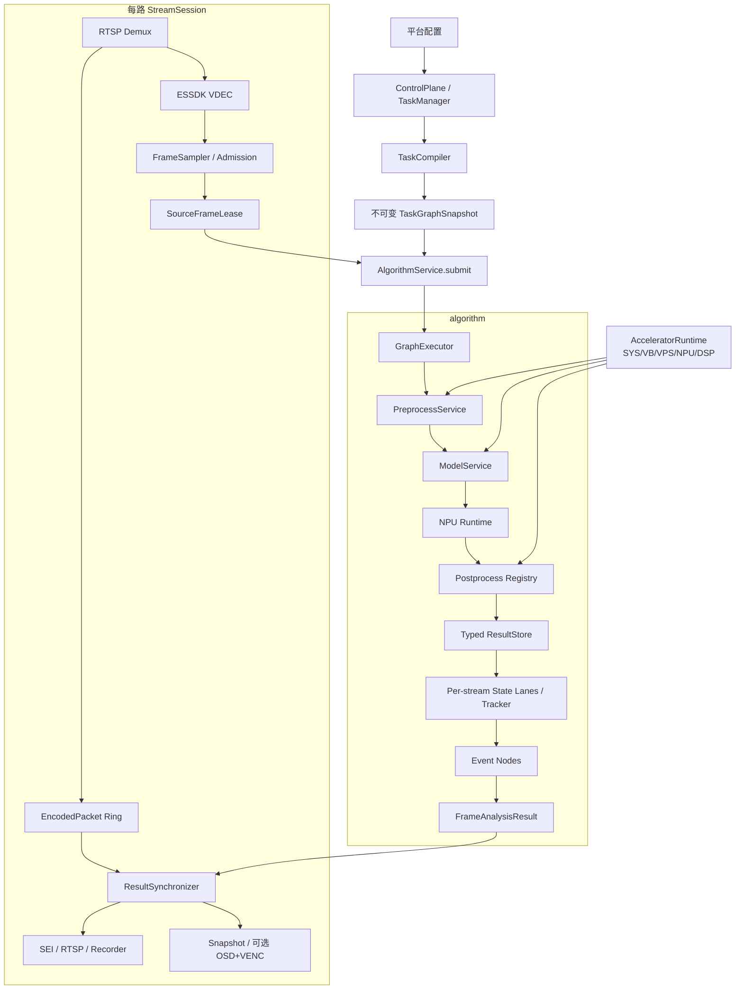

### 4.1 进程内完整组件架构图

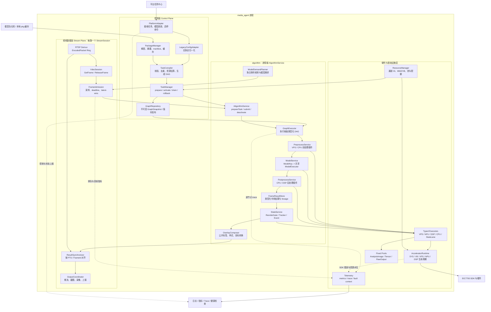

这张图规定了四条不可越过的边界：

1. `StreamSession` 只提交帧和消费结果，不创建具体模型对象；
2. `GraphExecutor` 只按快照执行，不读取正在修改的原始平台配置；
3. 所有硬件调用经固定类型 Executor 和 `AcceleratorRuntime`，业务线程不直接并发调用 SDK；
4. 输出侧只消费 `FrameAnalysisResult/OverlayScene/EventDecision`，不能反向持有 NPU tensor 或 VDEC frame。

### 4.2 部署、共享与隔离关系图

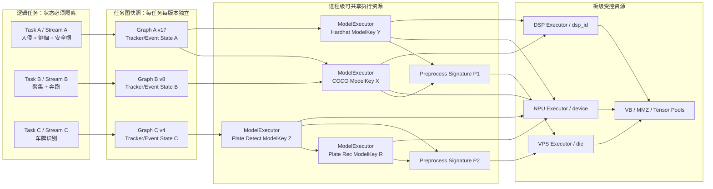

图中的共享是“执行资源共享”，不是“业务状态共享”。两个任务可以引用同一个 `ModelExecutor` 和只读后处理参数，但不得共享 tracker、事件窗口、ROI 状态、告警抑制状态或 graph version。

### 4.3 控制面

控制面不参与逐帧硬件调用，负责：

- 接收平台任务配置并验证；
- 解密/校验 pkg，生成内容摘要和模型 manifest；
- 编译 TaskGraph，计算共享模型、事件依赖和资源预算；
- 预热新模型和内存池；
- 以版本化不可变快照原子替换旧图；
- 旧图进入 draining，直到在途帧归零后释放；
- 汇总任务、模型、硬件和队列健康状态。

### 4.4 视频数据面

每路 `StreamSession` 管理 RTSP、VDEC、压缩包环形缓存、帧采样、结果同步和输出，不再拥有具体 detector。流只向全局 `AlgorithmService` 提交：

```cpp
AnalysisRequest {
    TaskId task_id;
    StreamId stream_id;
    FrameId frame_id;
    Timestamp pts;
    GraphVersion graph_version;
    SourceFrameLease source;
    Deadline deadline;
    CancellationToken cancel;
}
```

### 4.5 algorithm 数据面

algorithm 接收一帧和任务图，在图中只执行本帧需要的模型节点，缓存中间结果，然后把类型化输出送入 tracker/event 节点，最终返回 `FrameAnalysisResult`。它不负责 RTSP、录像文件或平台 IPC。

## 5. 配置域设计：Task、Event、Model 分离

配置必须先转换为规范化关系，再编译为执行图。下面的图展示“平台配置对象”和“运行时对象”之间的映射，避免把 event、model、executor 三个生命周期再次混在一起。

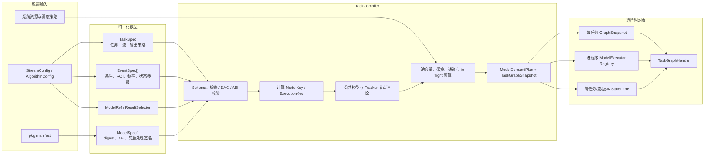

### 5.1 规范化数据结构

```cpp
struct TaskSpec {
    TaskId task_id;          // 平台任务 ID
    StreamId stream_id;      // 一任务一路流
    StreamPolicy stream;
    std::vector<EventSpec> events;
    OutputPolicy output;
};

struct EventSpec {
    EventId event_id;        // 同一任务内唯一
    std::string event_type;  // area-intrusion / helmet / plate-recognition ...
    ModelRef primary_model;
    std::vector<ModelRef> secondary_models;
    ResultSelector selector;
    RoiPolicy roi;
    SchedulePolicy schedule;
    EventParameters params;
};

struct ModelSpec {
    ModelKey key;            // 规范化身份
    PackageDigest digest;
    std::string model_type;  // yolov8_det / yolov8_pose / cls / face_det / lpr_rec ...
    DevicePlacement device;
    PreprocessSpec preprocess;
    RuntimeSpec runtime;
    PostprocessSpec postprocess;
    OutputSchema output_schema;
};
```

`ModelKey` 建议由以下内容计算，而不是只用 `model_scenario_code`：

```text
SHA256(pkg明文内容摘要
       + model二进制摘要
       + model_type
       + input/output tensor ABI
       + preprocess signature
       + postprocess signature
       + device placement)
```

阈值要分层：影响后处理候选生成的模型阈值属于 `PostprocessSpec`；仅影响某个事件是否接收目标的阈值属于 `ResultSelector/EventSpec`。这样两个事件可共享较宽松的模型输出，再分别过滤，不必因事件阈值不同重复推理。

### 5.2 同模型多事件编译示例

任务包含：区域入侵、人员徘徊、人员聚集，三者都使用 COCO person；另有安全帽检测使用 hardhat 模型。编译后的图为：

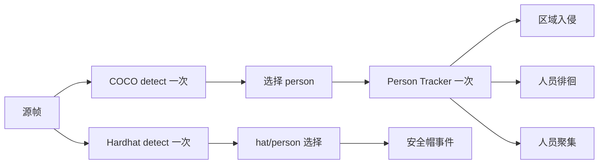

更完整的需求聚合与扇出关系如下。事件的执行频率、目标标签和 ROI 位于事件侧；公共模型节点只保留所有消费者共同需要的候选集合：

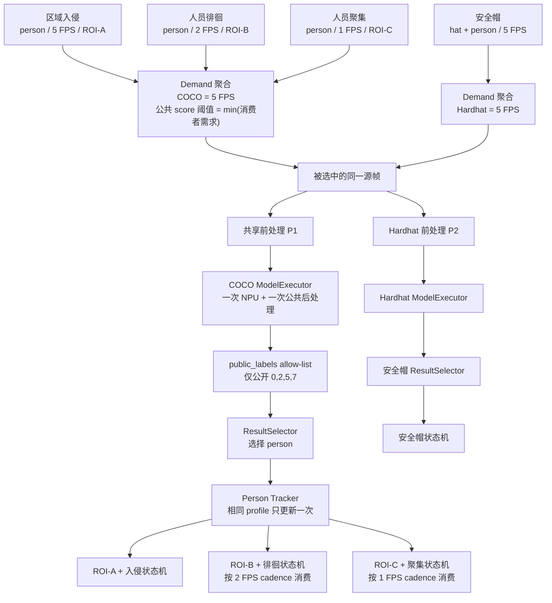

去重层次依次为：

1. 同一帧、同一 `ModelKey`：只执行一次模型；
2. 同一结果和相同 tracking profile：只跟踪一次；
3. 事件节点读取共享的不可变结果，但各自维护事件状态；
4. 不同任务/流之间共享模型实例和硬件队列，不共享 tracker/event 状态。

### 5.3 级联模型示例

车牌识别不应作为两个彼此无关的模型并行运行，而应编译成数据依赖：

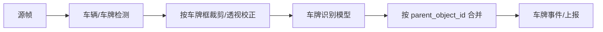

人脸识别同理：`face_det -> landmark/align -> embedding -> gallery match`。GraphExecutor 必须支持 frame-level 节点和 object-level fan-out 节点，并对每帧最大 ROI 数、二级模型并发数设硬上限。

### 5.4 共享推理的精确判定

“模型文件相同”只是共享的必要条件，不是充分条件。能合并为同一次执行的请求必须同时满足：

- 同一个源帧和 graph version；
- 相同 ModelKey、输入 tensor ABI 和 device placement；
- 相同源图/ROI。两个事件若分别要求在不同 ROI 内先裁剪再推理，不能共享输入；
- 相同前处理签名，包括颜色顺序、尺寸、letterbox、normalize 和 quantize；
- 后处理公共候选的参数兼容。

区域入侵等事件应优先采用“全帧检测一次，事件阶段再按 ROI 判断”，这样不同 ROI 仍能共享推理。只有模型本身要求 ROI 推理时，ROI 才进入 execution key。

多个事件需要不同频率时，由 `ModelDemandPlanner` 聚合需求。例如入侵需要 5 FPS、徘徊需要 2 FPS、聚集需要 1 FPS，同一模型按最高需求 5 FPS 执行；各事件按自己的 evaluation cadence 消费结果。若三个事件当前都处于禁用时间段，该模型节点不产生 demand，可以停止采样。不要为每个事件各维护一个帧计数器并重复提交同一模型。

多个事件阈值不同时，公共后处理使用能够保留所有事件候选的最低合理阈值，之后由各自 `ResultSelector` 过滤。公共阈值不能无限降低，否则候选框数量和 NMS/DSP 成本会失控；TaskCompiler 应根据模型上限和事件需求计算并验证。

### 5.5 平台协议演进与兼容

当前 protobuf 中 `StreamConfig` 没有独立 `task_id`，`AlgorithmConfig` 也没有 `event_id/model_id`，模型更新通过 `model_scenario_code` 定位。共享模型后，一个场景可以换模型、多个场景也可以引用同一模型，仅用 scenario code 已不足以表达身份。

推荐的新协议形态是：

```protobuf
message ModelReference {
  string model_id = 1;
  string version = 2;
  string package_uri = 3;
  string package_digest = 4;
}

message EventConfigV2 {
  string event_id = 1;
  string event_type = 2;
  string primary_model_id = 3;
  repeated string secondary_model_ids = 4;
  // threshold / ROI / schedule / event parameters ...
}

message StreamTaskV2 {
  string task_id = 1;
  string stream_id = 2;
  repeated ModelReference models = 3;
  repeated EventConfigV2 events = 4;
}
```

兼容期由 `LegacyConfigAdapter` 转换现有协议：

- `task_id` 暂时使用 `stream_id` 或平台配置批次与 stream_id 的组合；
- 为每个旧 AlgorithmConfig 生成稳定 event_id；
- 对模型路径进行规范化并计算 pkg digest，生成内部 model_id/ModelKey；
- 多个旧事件指向同一 digest 时自动共享；
- 旧的 `AlgorithmModelUpdate(model_scenario_codes)` 转换成受影响 model key 集合，但日志应提示这种定位存在歧义。

长期应把模型更新改成 `model_id + version/digest`，事件参数更新与模型包更新分开。模型没有变化时，修改 ROI、告警等级或事件阈值不应重建 NPU session。

## 6. algorithm 内部分层

建议将 `eic7700Infer` 重构为职责明确的六个子域。

### 6.1 algorithm 静态组件与接口依赖图

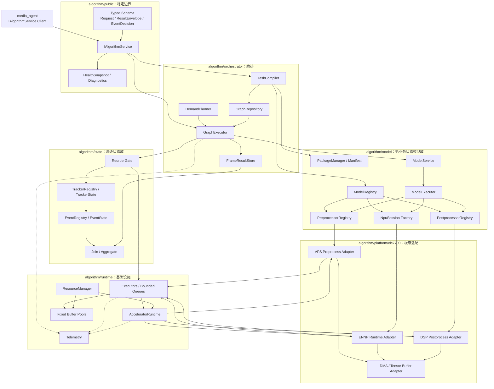

依赖方向必须保持向下：`public -> orchestrator -> model/state -> platform/runtime`。`platform/eic7700` 不引用具体事件，模型插件不引用 `StreamSession`，状态域也不能持有 NPU session。

### 6.2 package 与 manifest

`PackageManager` 负责解密、完整性验证、manifest 解析和只读缓存。当前每个 `ScopedModelPackageWorkspace` 临时解包后立即删除，不适合共享模型。目标设计中：

- pkg 按 digest 解密一次；
- 解密结果放入权限受限的运行时目录或匿名文件/memfd；
- `PackageHandle` 引用计数管理生命周期；
- manifest 声明模型 ABI，不从文件名猜测；
- 新版本预热成功后才切换，旧版本在图快照归零后清理。

建议 manifest 至少包含：

```yaml
schema_version: 2
model_type: yolov8_det
model_digest: ...
inputs:
  - name: images
    shape: [1, 3, 640, 640]
    dtype: int8
    layout: nchw
    pixel_format: bgr_planar
outputs:
  - {name: ..., shape: [...], dtype: int8, scale: ...}
preprocess: {...}
postprocess:
  plugin: yolov8_detect_v2
  backend: dsp
public_labels:
  0: person
  2: car
compatibility:
  essdk_min: 202606
```

### 6.3 类型与数据契约

去掉以 `std::vector<Detection>` 作为所有模型的公共结果。统一容器可以使用 `std::variant` 或稳定的 tagged schema：

```cpp
using ModelResult = std::variant<
    DetectionBatch,
    PoseBatch,
    ClassificationBatch,
    FaceBatch,
    TextDetectionBatch,
    TextRecognitionBatch,
    EmbeddingBatch
>;

struct ResultEnvelope {
    ModelKey model_key;
    ModelKind kind;
    StreamId stream_id;
    FrameId frame_id;
    GraphVersion graph_version;
    CoordinateTransform transform;
    std::shared_ptr<const ModelResult> payload;
    StageTimings timings;
};
```

每个 object 带稳定的 `object_id`；级联模型结果带 `parent_object_id`。所有坐标明确使用哪一个空间：源图像素、源图归一化坐标、模型输入坐标或 ROI 局部坐标。`CoordinateTransform` 保存 resize/letterbox/crop/rotation 的正逆变换，后处理不能各自重复手算。

`class_names` 继续采用稀疏字典语义，作为模型公开标签 allow-list；事件 `target_labels` 只做事件选择，不能改变模型类别索引，也不能决定公开结果 schema。

### 6.4 PreprocessService

接口按“转换计划”而不是按模型类设计：

```cpp
class IPreprocessor {
public:
    virtual PreprocessSignature signature() const = 0;
    virtual Future<PreparedTensor> submit(
        const ImageView& source,
        const RoiView& roi,
        BufferLease output,
        ExecutionContext&) = 0;
};
```

实现可包括：

- `VpsNv12ToTensorPreprocessor`：NV12 DMA -> BGR/RGB planar tensor；
- `VpsRoiPreprocessor`：源帧或对象 ROI -> tensor；
- `CpuImagePreprocessor`：单元测试、mock 或不支持格式回退；
- 后续可增加 batch preprocessor。

`PreprocessSignature` 应包含源格式、目标 shape/layout/dtype/color order、letterbox、normalization 和 quantization。只有签名完全相同时，同一帧的预处理 Tensor 才能被多个模型共享。不同模型即使输入尺寸相同，只要量化 scale 或颜色顺序不同，也不能误共享。

输出 Buffer 来自固定 `TensorPool`，任务结束自动归还。禁止逐帧无界 `MemAlloc/MemFree`。VPS 属性与执行线程绑定，因此 VPS worker 必须在自己的线程初始化属性并执行操作，不能在一个线程设置属性后交给另一线程调用。

### 6.5 RuntimeService

低层 `Eic7700Infer` 应收敛为只负责 ENNP runtime 的 `NpuSession`，不理解 YOLO、标签或 bbox：

```cpp
class NpuSession {
public:
    TensorAbi abi() const;
    Future<RawTensorSet> submit(
        const PreparedTensor& input,
        OutputBufferSet output,
        Deadline,
        CancellationToken);
};
```

`ModelExecutor` 是共享调度单位：

```cpp
class ModelExecutor {
    ModelDescriptor descriptor;
    std::vector<std::unique_ptr<NpuSession>> sessions;
    BoundedLatestQueue requests;
    TensorPool input_pool;
    TensorSetPool output_pool;
    std::shared_ptr<IPreprocessor> preprocessor;
    std::shared_ptr<IPostprocessor> postprocessor;
};
```

相同 `ModelKey` 的请求进入同一 executor。session 数量不是流数，而是经板端测量确定的模型并发度，初始建议每 NPU device、每模型 1 个 session。调度器可以让 VPS、CPU 后处理与另一任务的 NPU 重叠，但不能默认多个 context 同时重入 SDK 一定安全。

### 6.6 PostprocessService

后处理插件只接收 `RawTensorSet + Transform + ModelDescriptor`，返回类型化结果：

```cpp
class IPostprocessor {
public:
    virtual OutputSchema outputSchema() const = 0;
    virtual ModelResult run(const RawTensorSet&,
                            const TransformContext&,
                            PostprocessContext&) const = 0;
};
```

注册表以 manifest 中的 plugin 名称和版本选择实现：

```text
yolov8_detect_v2 -> DetectionBatch
yolov8_pose_v1   -> PoseBatch
yolov8_cls_v1    -> ClassificationBatch
retinaface_v1    -> FaceBatch
lpr_detect_v1    -> DetectionBatch(kind=plate)
lpr_rec_v1       -> TextRecognitionBatch
```

CPU 后处理原则上应是无状态、可重入对象；只读 anchors、labels、scale 在构造后不可变。DSP 后处理通过 `DspExecutor[dsp_id]` 有界队列提交，`ES_AK_SetDevice` 和 DetectionOut 在受控线程执行。只有 CPU 和 DSP 的输入/输出 ABI 相同且 manifest 显式声明 fallback，才允许 DSP 失败回退 CPU。

### 6.7 ModelRegistry 与工厂

当前 `EdgeInfer` 固定 `std::make_unique<YoloV8Det>()` 应替换为注册表：

```cpp
struct ModelPlugin {
    ModelKind kind;
    ManifestValidator validate;
    PreprocessorFactory make_preprocessor;
    PostprocessorFactory make_postprocessor;
};

ModelPluginRegistry::registerPlugin("yolov8_det", ...);
ModelPluginRegistry::registerPlugin("yolov8_pose", ...);
ModelPluginRegistry::registerPlugin("classifier", ...);
ModelPluginRegistry::registerPlugin("retinaface", ...);
```

新增模型通常只需要：定义结果 schema、manifest validator、后处理插件；如果已有相同前处理和 NPU runtime，不改调度器、任务图和 media_agent。

初期建议使用编译期静态注册，不立即开放任意第三方 `.so` 动态插件。C++ ABI、异常边界和不可信后处理代码会显著增加稳定性风险。等接口稳定后，如确需运行时扩展，应提供版本化 C ABI、插件 capability 描述和独立进程隔离，而不是直接跨共享库传递 STL 对象。

### 6.8 StateService：Tracker 与 Event

Tracker 和 Event 是有状态阶段，不能与无状态模型执行器一起全局共享。状态作用域必须是：

```text
TaskId + StreamId + GraphVersion + StateProfile
```

建议每路流有一个 `StateLane`，保证同一路的状态提交按 `frame_sequence` 有序：

- 模型推理可以跨流并行、甚至同一流在将来允许少量并行；
- 进入 tracker/event 前必须经过 reorder gate；
- 超时或丢帧要以显式 `FrameGap` 通知状态机，而不是悄悄缺帧；
- 多个事件共享同一 tracking profile 时，先跟踪一次再扇出；
- 不同类别、不同模型或不同 tracker 参数使用独立 tracker state；
- 事件节点只读共享结果，自己的停留时间、计数窗口、去重状态相互隔离。

### 6.9 单帧从解码到事件输出的完整时序图

```mermaid
sequenceDiagram
    autonumber
    participant VDEC as VdecSession
    participant FA as FrameAdmission
    participant AS as AlgorithmService
    participant GX as GraphExecutor
    participant VPS as VpsExecutor
    participant NPU as NpuExecutor
    participant POST as PostprocessExecutor
    participant STATE as StateLane
    participant SYNC as ResultSynchronizer
    participant OUT as OutputCoordinator

    VDEC->>FA: SourceFrameLease(frame_id, pts)
    FA->>FA: 检查 graph version、deadline、每流 in-flight
    alt 队列已满或本帧不满足采样
        FA-->>VDEC: 立即析构 lease / ReleaseFrame
        FA-->>SYNC: SkipReason(frame_id)
    else 接纳本帧
        FA->>AS: submit(AnalysisRequest + snapshot)
        AS->>GX: 创建 FrameExecutionContext
        GX->>VPS: 提交一级模型共享前处理
        VPS-->>GX: PreparedTensorLease + Transform
        GX-->>VDEC: 源帧不再需要后 ReleaseFrame

        par 就绪模型可并发排队但由设备限流
            GX->>NPU: COCO request(ModelKey X)
            NPU-->>GX: RawTensorSet X
            GX->>POST: yolov8_detect_v2(X)
            POST-->>GX: DetectionBatch X
        and
            GX->>NPU: Hardhat request(ModelKey Y)
            NPU-->>GX: RawTensorSet Y
            GX->>POST: yolov8_detect_v2(Y)
            POST-->>GX: DetectionBatch Y
        end

        GX->>GX: public_labels allow-list + ResultSelector
        GX->>STATE: 按 frame_sequence 提交共享结果
        STATE->>STATE: ReorderGate -> Tracker -> Event nodes
        STATE-->>GX: TrackedResult + EventDecision
        GX->>GX: Aggregate + OverlayComposer
        GX-->>AS: FrameAnalysisResult(ok / partial)
        AS-->>SYNC: completion(frame_id, pts, graph_version)
        SYNC->>SYNC: 与 EncodedPacket/显示帧按 PTS 对齐
        SYNC->>OUT: overlay / alarm / snapshot / recorder metadata
    end
```

若模型超时，已提交的硬件任务仍须安全完成并归还 buffer，但其结果标记为 stale，不进入 `StateLane`。同一帧中无依赖的模型允许形成 `partial` 结果；级联模型则只取消失败节点的下游分支。

## 7. TaskGraph 设计

TaskGraph 是“一个任务的一帧需要做什么”的不可变执行计划，不是运行线程图。节点描述数据依赖和失败传播，实际在哪个线程或硬件设备执行由节点的 `ExecutionDomain` 决定。

### 7.1 完整 TaskGraph 示例

下面示例同时包含共享检测、多事件扇出、姿态模型以及车牌二级识别，展示 frame-level、object-level 和 stateful 节点如何共存：

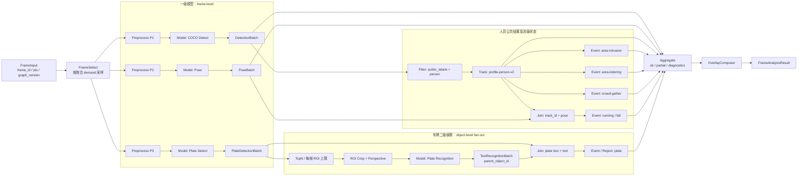

图执行时需要保存以下 lineage：`frame_id -> model_result_id -> object_id -> parent_object_id -> track_id -> event_decision_id`。这样日志、OSD 和平台上报都能追溯“某个事件使用了哪一帧、哪个模型版本和哪个目标”。

### 7.2 节点类型

目标图不必做成任意通用工作流引擎，只支持视频算法所需的有限节点：

| 节点 | 输入 | 输出 | 状态 |
|---|---|---|---|
| FrameSelect | SourceFrame | SelectedFrame/Skip | 流级轻状态 |
| Model | Image/ROI | ResultEnvelope | executor 共享，推理无业务状态 |
| Filter | ResultEnvelope | ResultView | 无状态 |
| Track | Detection/Pose | TrackedResult | 流级有状态 |
| RoiExpand/Align | Object + Image | ROI 列表 | 无状态 |
| Join | 父子结果 | CompositeResult | 帧级短状态 |
| Event | ResultView | EventDecision | 流级有状态 |
| Aggregate | 多事件结果 | FrameAnalysisResult | 帧级短状态 |

### 7.3 编译期校验

TaskCompiler 在接收配置时完成：

- 模型引用存在且 pkg/ABI 合法；
- 节点输入 schema 与上游输出 schema 匹配；
- 图无环；
- 同一个 `ModelKey` 自动公共子表达式消除；
- 可共享的 tracker 节点去重；
- 级联 fan-out 上限和资源预算合法；
- 事件需要的 label 在模型 public label 字典中存在；
- 输出坐标空间可转换回源图；
- 估算每模型 Tensor pool、VDEC transfer pool 和最大 in-flight 内存。

配置错误应在任务激活前返回 ACK 失败，不能到第一帧才发现 shape、类别或后处理 ABI 不匹配。

### 7.4 图快照与热更新

`TaskGraphSnapshot` 构造后不可变，逐帧请求只持有 `shared_ptr<const Snapshot>`，避免运行时对配置加大锁。更新流程：

```text
接收新配置
-> 编译新图
-> acquire/预热新 ModelExecutor
-> 资源预算检查
-> 原子 publish 新 graph_version
-> 新帧只进入新图
-> 旧图停止接收并等待 in-flight=0
-> 释放旧状态和不再引用的模型
```

同一 frame 的所有节点必须使用同一 graph version，禁止推理到一半读取新事件配置。

### 7.5 热更新双版本并存时序图

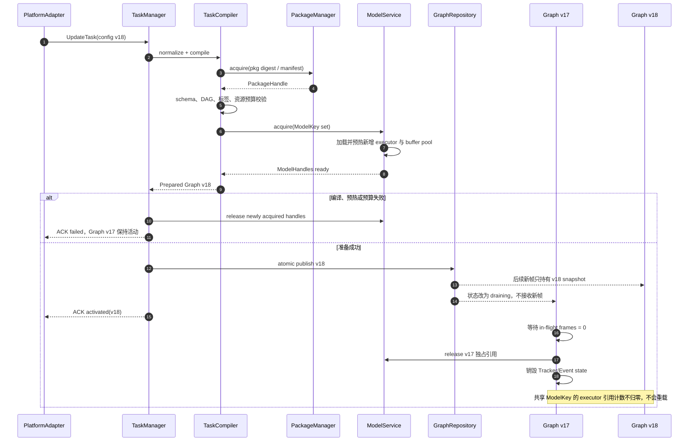

热更新失败必须是事务性的：publish 前的任何失败都不影响旧图；publish 后不再回退同一帧的版本，只允许平台再次发布新版本。旧图 draining 可以设上限，但超时时应先取消未开始节点并等待已提交硬件安全回收，不能直接析构其 buffer/session。

## 8. 调度与并发安全

### 8.1 执行域、线程归属与队列图

```mermaid
flowchart LR
    subgraph ING["输入线程域"]
        S1["Stream A VDEC callback"]
        S2["Stream B VDEC callback"]
        SN["Stream N VDEC callback"]
        FAS["FrameAdmissionScheduler<br/>每流 pending <= 1"]
    end

    subgraph VPSD["VPS 执行域：SerializedExecutor / die"]
        VQ["Bounded Fair Queue"] --> VW["VPS Worker<br/>SetAttr + Process + Sync"]
    end

    subgraph NPUD["NPU 执行域：Serialized 或实测有限并发 / device"]
        MQ1["Model X latest queue"] --> ARB["Fair Arbiter<br/>stream round-robin + deadline"]
        MQ2["Model Y latest queue"] --> ARB
        ARB --> NW["NPU Session Slot(s)"]
    end

    subgraph POSTD["后处理执行域"]
        CPUQ["CPU Post Pool<br/>无状态、可重入"]
        DSPQ2["DSP Bounded Queue"] --> DSPW["DSP Worker / dsp_id"]
    end

    subgraph STATED["状态执行域：LaneConfined"]
        RGA["Stream A ReorderGate"] --> SLA["Stream A StateLane"]
        RGB["Stream B ReorderGate"] --> SLB["Stream B StateLane"]
    end

    subgraph OUTD["输出执行域"]
        CQ["Completion Queue"] --> EQ["Evidence Queue<br/>报警优先 + 硬上限"] --> PUB2["SEI / 推流 / 截图 / 录像"]
    end

    S1 --> FAS
    S2 --> FAS
    SN --> FAS
    FAS --> VQ
    VW --> MQ1
    VW --> MQ2
    NW --> CPUQ
    NW --> DSPQ2
    CPUQ --> RGA
    CPUQ --> RGB
    DSPW --> RGA
    DSPW --> RGB
    SLA --> CQ
    SLB --> CQ
```

线程归属规则：VDEC callback 只交接 lease，不执行前处理；VPS/NPU/DSP worker 独占或受控使用其 SDK context；CPU 后处理不得携带可变全局状态；Tracker/Event 只能由对应 `StateLane` 调用；完成回调只传不可变结果，不能在硬件 worker 上执行截图或网络 I/O。

### 8.2 调度分层

不要用一个全局线程池同时承担所有阶段。建议分为：

1. `FrameAdmissionScheduler`：按流公平选帧，每路默认最多一个 graph request 在途；
2. `VpsExecutor[die]`：固定 worker、有界队列、线程内属性；
3. `NpuExecutor[device]`：管理多个 ModelExecutor/session，按 deadline 和流公平调度；
4. `CpuPostPool`：执行无状态 CPU 后处理，可并行；
5. `DspExecutor[dsp]`：固定 worker/有限并发；
6. `StateLane[stream]`：有序 tracker/event；
7. `EvidenceExecutor`：截图、录像控制，不阻塞算法完成回调。

### 8.3 并发安全契约

每个类必须明确标注以下三种之一：

- `Immutable/ThreadSafe`：构造后只读，可并发调用，例如 manifest、CPU 无状态后处理参数；
- `SerializedExecutor`：对象本身不对外暴露并发，所有调用进入固定执行器，例如 VPS/DSP session；
- `LaneConfined`：只允许所属 stream lane 调用，例如 tracker/event state。

禁止通过“每个公开方法内部都加 mutex”掩盖所有权不清。锁只保护短元数据，不跨越 VPS/NPU/DSP 阻塞调用，不在持锁状态执行回调。

### 8.4 队列、背压和丢帧

所有队列必须有界并声明满时策略：

| 队列 | 建议满策略 |
|---|---|
| 流待推理帧 | latest-wins，替换尚未开始的旧帧 |
| ModelExecutor 请求 | 同一 stream/model 合并为最新请求；已提交 NPU 的不能硬取消 |
| VPS/NPU/DSP | admission 前拒绝或降级，不无界积压 |
| StateLane | 小容量有序队列；缺帧发送 FrameGap |
| 证据队列 | 报警优先，有硬上限并报告 dropped evidence |
| RTSP 发布 | 与算法结果采用超时同步，不能无限等待 |

每个 `AnalysisRequest` 带 deadline。deadline 超过后：

- 未开始的节点取消并释放 lease；
- 已在硬件执行的任务等待安全回收，但结果标记 stale，不再进入事件状态；
- ResultSynchronizer 发布无结果帧或按策略复用最近稳定结果；
- 任何超时都不能阻止 VDEC 帧归还和后续帧处理。

### 8.5 背压与 deadline 决策图

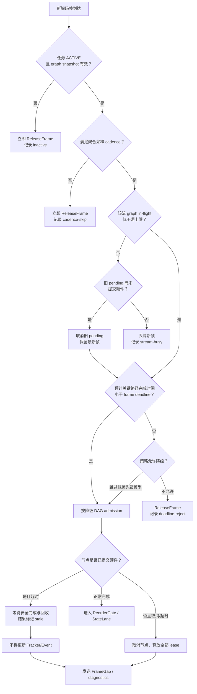

`latest-wins` 只允许替换“尚未提交硬件”的请求；已进入 SDK 的 frame/tensor 绝不能因为新帧到达而被复用。预计完成时间应由各执行域队列深度和滑动延迟统计计算，不能只用线程数估算。

### 8.6 公平性与优先级

NPU 调度采用两级公平：先在 active stream 间轮询，再在该帧就绪的模型节点间按关键路径/期限选择。不能让一个含 4 个模型的任务持续占用设备，饿死只有 1 个模型的其他流。

建议配置：

- 每流 graph in-flight 初始为 1；
- 每流每模型 pending 初始为 1；
- 每 NPU device 最大 submitted 数初始为 1，再通过板测提高；
- 二级 ROI 模型每帧限制 top-N，且全局限制 ROI/s；
- 事件优先级只影响调度权重，不突破硬件和内存硬上限。

### 8.7 锁、回调和对象生命周期规则

- Registry/graph map 使用读多写少的快照或 `shared_mutex`，逐帧路径只获取不可变 `shared_ptr`；
- mutex 只保护队列、计数和状态转换，不覆盖 `ES_VPS_*`、`ES_NPU_ProcessReport`、`ES_AK_*` 等可能阻塞的 SDK 调用；
- SDK session 由所属 executor 线程独占时，不再给 session 每个方法重复加锁；
- completion 回调在释放内部锁和硬件 lease 后执行；
- Future 状态持有结果值，不持有裸 `TaskGraph*`、裸 frame 指针或可被热更新销毁的配置引用；
- cancellation 是协作式的：禁止新阶段开始；已经提交硬件的任务只能走 SDK 安全 abort/synchronize 或等待完成后丢弃结果；
- 关闭顺序通过 structured concurrency 管理：父 TaskScope 先停止产生子任务，再等待全部子 Future 结束，最后销毁 pool/session。

### 8.8 池容量与内存预算

池大小不能简单等于线程数。对一个 ModelExecutor，最低需要覆盖：

```text
输入 tensor 数 >= session 数 + 已完成前处理但等待 NPU 的有界槽位
输出 tensor set 数 >= session 数 + 已完成 NPU 但等待后处理的有界槽位
结果对象数 >= state lane / synchronizer 允许的在途帧数
```

TaskCompiler/ResourceManager 应按模型 tensor ABI 计算字节数，再叠加 VDEC、analysis image、OSD/VENC 和证据缓存预算。任何池耗尽都进入定义好的背压策略；逐帧路径不得临时扩大池来掩盖容量不足。

## 9. Buffer 所有权与 VDEC 解耦

### 9.1 Buffer 所有权与引用边界图

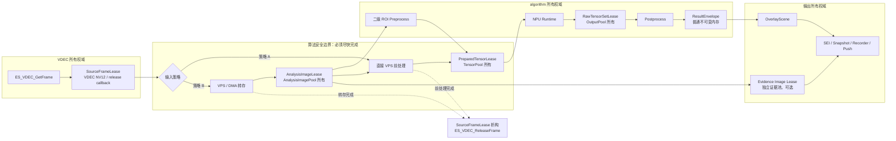

关键禁止关系：`ResultEnvelope`、Tracker/Event、`OverlayScene` 和网络/文件输出均不得持有 `SourceFrameLease`；`PreparedTensorLease` 在 NPU 完成前不得归池；`RawTensorSetLease` 在后处理完成前不得归池；若证据需要原图，必须显式获得 `AnalysisImageLease/EvidenceImageLease`，不能延长 VDEC frame 生命周期。

### 9.2 两类帧租约

定义两个不同的所有权对象：

```text
SourceFrameLease
  - 指向 VDEC GetFrame 得到的 NV12
  - 析构必须 ES_VDEC_ReleaseFrame
  - 生命周期必须短

AnalysisImageLease / PreparedTensorLease
  - 来自 algorithm 自有固定 VB/Tensor pool
  - 与 VDEC Group 生命周期无关
  - 可被后续模型、OSD 或证据阶段持有
```

FrameAdmission 接收 SourceFrameLease 后，执行本帧所需的共享前处理或一次 NV12 DMA 转存。安全边界完成后立即归还 VDEC 帧，不允许一直持有到事件、SEI、截图和 RTSP 发布结束。

### 9.3 两种落地策略

**策略 A：直接前处理后立即释放源帧。** 若一帧只需若干一级模型，依次/受控并行完成所有源图前处理，将小尺寸 Tensor 写入 algorithm 池，然后释放 VDEC。优点是少一份原图复制；缺点是多个模型前处理完成前仍持有源帧。

**策略 B：转存一份 analysis NV12 后立即释放。** 使用 VPS/硬件 DMA copy 把源图或适当降采样图复制到 analysis pool，后续所有模型和截图从该副本读取。优点是 VDEC 生命周期最短、易于超时取消；缺点是增加 DDR 带宽和池内存。

推荐默认 A，并设置很短的 source lease deadline；当模型数多、级联多或 VPS 排队导致租约超时风险时切换 B。若 VDEC 双输出稳定，可使用低分辨率 ch0 作为算法源、原分辨率 ch1 只进入显示/证据路径，进一步降低前处理压力。

### 9.4 VDEC 正确退出

StreamSession 退出必须成为状态机：

```text
RUNNING
-> QUIESCING：停止新包、新帧和 graph admission
-> DRAINING：取消 pending，等待 SourceFrameLease/硬件任务归零
-> STOPPED：StopRecv、CloseFd、DisableChn、DetachVbPool
-> DESTROYED：DestroyGrp、DestroyPool；成功后释放 Group ID
```

DestroyGrp 失败不得释放 Group ID；DestroyPool 失败不得把 pool 标为无效。全进程最后一个 VDEC Group 成功销毁后才 Deinit。

### 9.5 StreamSession 停止与 VDEC 销毁时序图

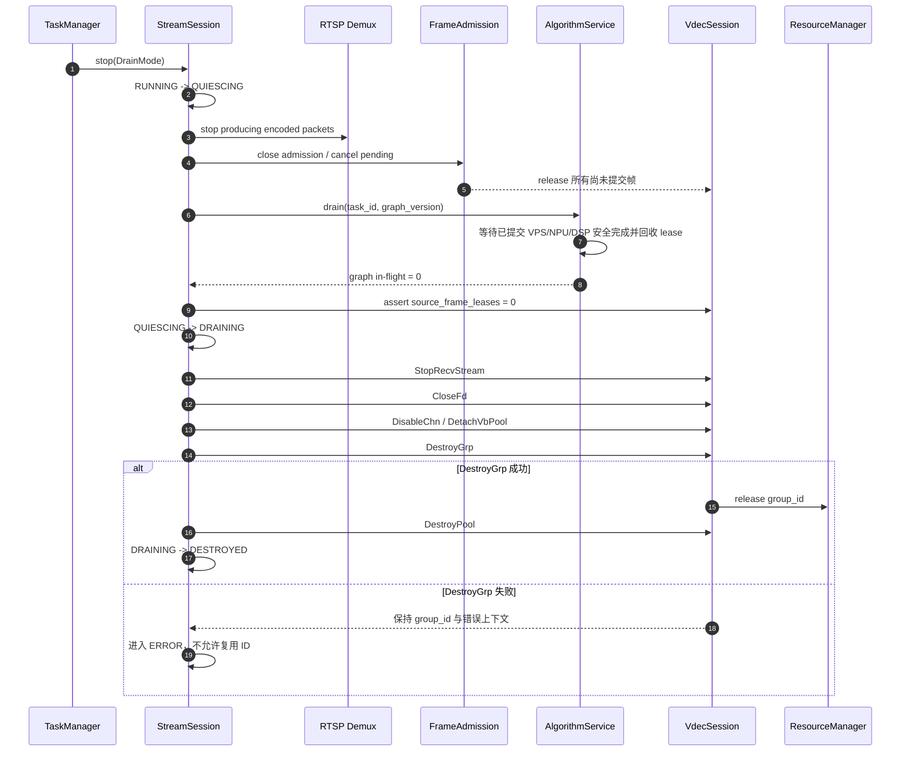

## 10. SDK 生命周期与硬件资源服务

### 10.1 全进程 SDK 资源拓扑图

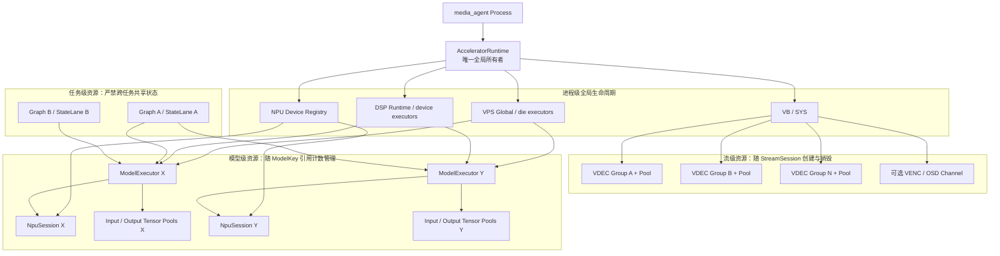

### 10.2 AcceleratorRuntime

创建进程唯一 `AcceleratorRuntime`，启动和退出顺序为：

```text
进程启动：VB/SYS -> VPS -> NPU device registry -> DSP runtime
业务启动：VDEC groups -> model sessions -> task graphs

业务退出：停止图 -> 归还帧/tensor -> tracker/event -> model sessions
          -> VDEC groups/pools -> DSP/NPU/VPS -> SYS/VB
```

实际某模块是否需要显式全局 Init 以目标 SDK 头文件和手册为准，但所有 Init/Exit 必须只有一个逻辑所有者，禁止 VDEC、preprocessor、测试工具分别决定 SYS 的最终退出。

### 10.3 资源目录

`ResourceManager` 至少维护：

- 跨进程安全的 VDEC Group 和 VENC Channel 分配；
- 每 die 的 MMZ/VB 预算；
- VPS executor 和 IOVA 映射数；
- NPU device、model session、in-flight task；
- DSP ID 和队列；
- 可选 OSD/VENC 通道预算。

配置激活前做 admission：资源不足时明确拒绝某任务或按策略降级，不能先创建一半资源再在逐帧路径随机失败。

## 11. media_agent 与 algorithm 的接口

### 11.1 接口边界与结果分发图

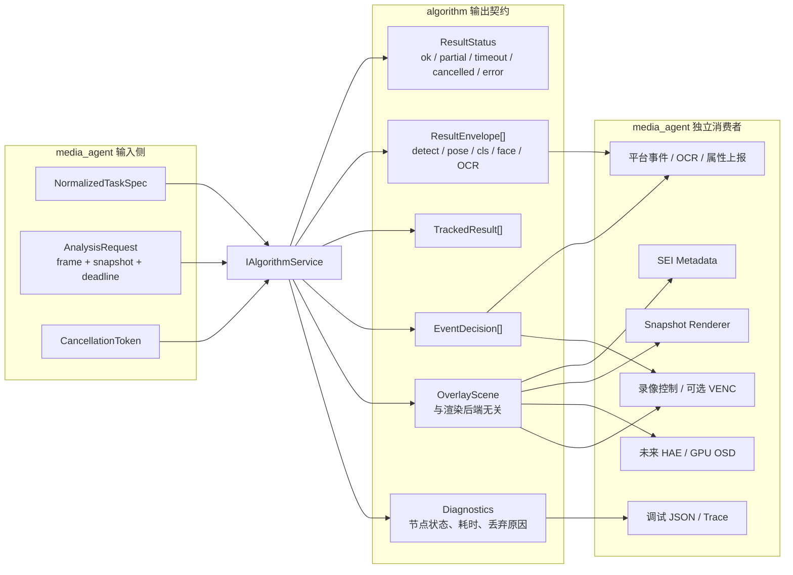

`OverlayScene` 的基础几何来自推理模块对 `public_labels/class_names` 的过滤结果，事件模块只能增加命中标识、颜色、区域和文本样式，不能把未公开类别重新放回 overlay。录像是否真正烧录 bbox 取决于是否经过 OSD + VENC；仅把 `OverlayScene` 写入 SEI 或旁路元数据不会改变原始压缩视频像素。

### 11.2 控制接口

```cpp
class IAlgorithmService {
public:
    virtual CompileResult prepareTask(const NormalizedTaskSpec&) = 0;
    virtual ActivateResult activate(TaskGraphHandle) = 0;
    virtual Future<FrameAnalysisResult> submit(AnalysisRequest) = 0;
    virtual void deactivate(TaskId, DrainMode) = 0;
    virtual HealthSnapshot health() const = 0;
};
```

接口采用异步 Future/Completion，不能继续使用 `infer(..., vector<object_result>&)` 这种同步、无 deadline、无 model identity 的调用形式。

### 11.3 统一帧结果

```cpp
struct FrameAnalysisResult {
    TaskId task_id;
    StreamId stream_id;
    FrameId frame_id;
    Timestamp pts;
    GraphVersion graph_version;
    ResultStatus status;          // ok/partial/timeout/cancelled/error
    std::vector<ResultEnvelope> model_results;
    std::vector<TrackedResult> tracked_results;
    std::vector<EventDecision> event_decisions;
    OverlayScene overlay;         // 由推理结果生成，不由事件结果替代
    Diagnostics diagnostics;
};
```

`OverlayScene` 是与具体输出方式无关的绘制描述，可转换为：

- 当前 MSP SEI；
- Snapshotter 的绘制命令；
- 后续 HAE/GPU OSD；
- 调试 JSON。

事件只给命中的 object 设置 style/tag，并生成 `EventDecision`；是否显示 bbox 仍由模型 `public_labels/class_names` 和 overlay policy 决定。

### 11.4 部分成功语义

多模型任务不能用一个 bool 表示成败。`FrameAnalysisResult` 要区分：

- COCO 成功、hardhat 超时：依赖 COCO 的事件仍可运行，安全帽事件跳过；
- detect 成功、二级 OCR 部分 ROI 失败：返回成功识别项和失败计数；
- tracker reset：模型结果仍可用于 overlay，但依赖连续轨迹的事件本帧不可判断；
- graph 已换版本：旧结果可丢弃，不能送入新版本状态机。

### 11.5 节点失败传播图

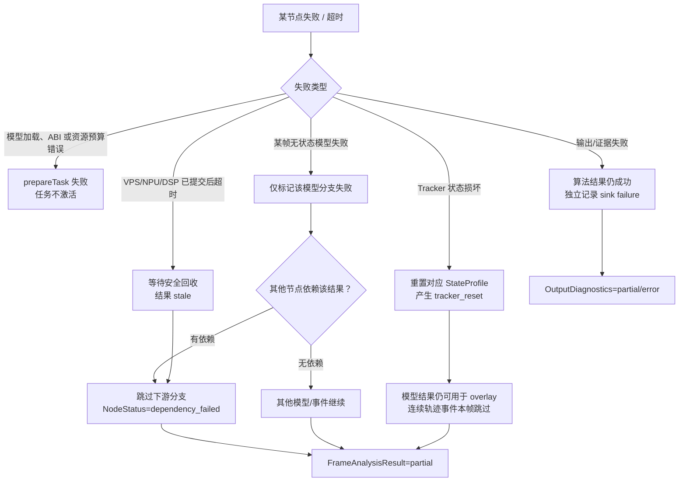

任何节点异常都必须被收敛为类型化 `NodeStatus`，不能让异常越过 executor 线程边界或用一个 `false` 抹掉已成功的其他分支。只有进程级 SDK 不可恢复错误、内存一致性错误等才升级为全局熔断；普通模型或单路流错误只隔离相应作用域。

## 12. 模型扩展示例

### 12.1 YOLOv8 Pose

- 复用 NV12 -> tensor 前处理和 NPU Runtime；
- 新增 `yolov8_pose` manifest validator；
- 新增 pose 后处理，输出 `PoseBatch`；
- `PoseBatch` 包含 person bbox、keypoints、point scores；
- OSD collector 消费 PoseBatch；跌倒/姿态事件消费 PoseBatch 或 TrackedPoseBatch。

### 12.2 Classification

- 输出 `ClassificationBatch`，包含 top-k，不伪造 bbox；
- 全帧分类节点输入 source image；
- ROI 分类节点输入上游检测对象的裁剪；
- 每个分类结果通过 `parent_object_id` 回挂检测对象。

### 12.3 人脸检测与识别

```text
FaceDetectionBatch
-> FaceAlignNode(landmarks)
-> EmbeddingModel
-> GalleryMatchNode
-> FaceIdentityResult
```

图库检索不属于 NPU Runtime，可以作为 CPU/向量库插件；图库版本也要进入 graph version，避免热更新前后身份结果混用。

### 12.4 车牌识别

```text
PlateDetection
-> Quad/Perspective Transform
-> PlateRecognition
-> TextNormalization
-> PlateResult
```

车牌文字结果进入专门 OCR 上报和 overlay，不再通过 `class_name=text` 勉强表达全部语义。

## 13. 可观测性、故障隔离与测试

### 13.1 指标维度

每条指标至少带 `task_id/stream_id/model_key/stage/device/graph_version`：

- admission accepted/replaced/dropped；
- source frame lease 持有时间、VDEC in-flight；
- VPS/NPU/DSP queue wait、execute、timeout；
- 每模型 FPS、p50/p95/p99 延迟、失败状态；
- Tensor/VB pool used/high-watermark；
- tracker reorder depth、FrameGap、reset；
- 每事件 evaluated/triggered/skipped；
- ResultSynchronizer 等待和 SEI miss；
- snapshot/record 成功、失败和丢弃。

### 13.2 故障隔离

- 单模型连续失败触发该 executor 熔断和重建，不重启全部流；
- 单事件异常禁用该 event node，不破坏共享模型结果；
- NPU device fatal 进入设备级 unavailable，停止 admission 并受控重建 sessions；
- VDEC fatal 只重建对应 StreamSession；
- 非可信第三方后处理若存在内存安全风险，可进一步放到独立 worker 进程；单进程插件接口并不妨碍后续进程隔离。

### 13.3 测试分层

1. Stage 单元测试：固定 tensor golden data 验证每种 postprocess；
2. Manifest/ABI 契约测试：错误 shape、dtype、label index 必须在激活前失败；
3. Graph 编译测试：共享模型去重、级联、部分失败、版本切换；
4. 并发测试：多线程 submit、取消、热更新、析构竞态；
5. Mock Runtime：不用开发板验证调度和状态顺序；
6. 板端硬件测试：VPS/NPU/DSP 并发矩阵和 pool 边界；
7. 长稳测试：多流断连、模型更新、告警截图、内存/IOVA/VB 泄漏；
8. 故障注入：BUF_FULL、ProcessReport 超时、DSP 失败、DestroyGrp 失败。

## 14. 推荐目录结构

```text
media-agent/src/
  control/
    TaskManager.*
    TaskCompilerAdapter.*
  stream/
    StreamSession.*
    FrameAdmission.*
    ResultSynchronizer.*
    EsDecoder.*
  output/
    OverlayScene.*
    SeiOutput.*
    SnapshotOutput.*
    EncodedOutput.*
  algorithm_client/
    AlgorithmServiceAdapter.*

third_party/algorithm/
  include/algorithm/                 # 稳定、平台无关、可安装的公共头文件
    inference_backend.h              # IInferenceBackend / FrameView / Request
    result_schema.h                  # detect/pose/cls/face/plate 类型化结果
    backends/
      eic7700_backend.h              # 仅暴露工厂，不泄漏 ESSDK 类型
      rk3588_backend.h               # 预留
      nvidia_backend.h               # 预留
  graph/
    task_compiler.*
    graph_executor.*
    graph_snapshot.*
  package/
    package_manager.*
    manifest.*
  platform/
    eic7700/
      accelerator_runtime.*
      resource_manager.*
      npu_session.*
      vps_executor.*
      dsp_executor.*
      buffer_pool.*
    rk3588/                          # 预留 RGA/RKNN 实现
    nvidia/                          # 预留 CUDA/TensorRT 实现
  model/
    model_registry.*
    model_executor.*
    plugins/
      yolov8_detect/
      yolov8_pose/
      yolov26_detect/
      yolov8_classification/
      retinaface/
      plate_detect/
      plate_recognize/
  preprocess/
    preprocess_registry.*
    vps_nv12_tensor.*
    vps_roi_tensor.*
  postprocess/
    postprocess_registry.*
  state/
    state_lane.*
    tracker_registry.*
    event_registry.*
```

原 `eic7700Infer` 名称容易让“板级 runtime”和“整个算法框架”混为一谈。迁移期允许目录继续存在，但其中公共接口必须上移到 `include/algorithm`，ESSDK 实现只能留在 `platform/eic7700`；后续 RK3588、NVIDIA 以同级 backend 接入。algorithm 对外只暴露平台无关的 `IAlgorithmService`/`IInferenceBackend` 和类型化 schema。

## 15. 分阶段迁移路线

### 阶段 0：先补正确性，不改变外部行为

- 进程级 SDK 生命周期；
- VDEC in-flight 和正确销毁状态机；
- BUF_FULL 有限重试；
- 所有队列加硬上限和指标；
- 推理结果超时不再永久阻止发布。

### 阶段 1：拆分 eic7700Infer 三阶段

- 定义 `PreparedTensor/RawTensorSet/ModelResult`；
- 从 `YoloV8Det` 中抽出 Preprocessor、NpuSession、Postprocessor；
- 建 ModelPluginRegistry，先迁移 YOLOv8 detect；
- 保留旧 EdgeInfer facade 做兼容适配，但内部走新 executor。

### 阶段 2：引入 ModelService 和同任务去重

- 使用 ModelKey；
- 同一 StreamConfig 内相同 pkg 只推理一次；
- 多事件消费共享 DetectionBatch；
- tracker 按 profile 共享、event 独立。

### 阶段 3：跨任务共享和异步接口

- 全进程共享 ModelExecutor；
- `AlgorithmService.submit` 异步化；
- per-model bounded latest queue、公平调度、deadline/cancel；
- detector 热更新切换为 graph snapshot。

### 阶段 4：类型化模型扩展

- 先增加 pose 和 classification，验证非 bbox schema；
- 再增加 face detect/embedding、plate detect/recognition，验证 ROI fan-out 和 Join；
- OverlayScene、IPC/OCR 上报同步扩展。

### 阶段 5：硬件吞吐优化

- 板测确定 VPS worker、NPU session、DSP 并发度；
- 评估 VDEC 双输出和 analysis NV12 pool；
- 有数据后再决定 batch、跨流动态 batching 或 HAE/GPU OSD + VENC。

每个阶段都必须可以独立回滚。不要同时重写 VDEC、平台协议、模型插件和事件模块。

## 16. 不建议的方案

1. **每个事件创建一个完整 detector。** 实现简单但重复模型、前处理和 NPU 调用，事件越多浪费越严重。
2. **只把 `EdgeInfer` 内三个目录改名。** 文件更整齐，但资源共享、结果类型和并发契约没有改变。
3. **把 pipeline 的全部 Element/Meta 框架复制进 media_agent。** 会形成两个控制框架和大量适配层，动态任务、事件和 RTSP 业务反而更复杂。
4. **用一个全局 mutex 包住整个 infer。** 安全但完全串行，且锁等待不可观测，无法形成阶段流水。
5. **直接把 NPU in-flight 提高到流数。** SDK host API、context、report 和硬件容量未经验证，容易将吞吐问题变成稳定性问题。
6. **所有模型都返回 `vector<Detection>`。** pose/cls/OCR 的信息会永久丢失，后续每加一个模型都要在字段上打补丁。
7. **让事件配置决定 class_names。** 模型索引、公开标签和事件目标是三个概念，混合后会导致类别错位和重复打包。
8. **用未完成推理结果继续更新 tracker/event。** stale/跨版本结果会破坏时序状态；可以用于诊断，不能进入当前状态机。

## 17. 验收标准

目标架构完成后，应满足：

- 同一任务三个事件引用同一个模型时，每个采样帧只出现一次模型执行记录；
- 两个任务引用同一 ModelKey 时共享模型二进制和 executor，但 tracker/event 状态隔离；
- 新增 classification 模型不修改 detect 结果结构和事件主循环；
- 任一 VPS/NPU/DSP 任务超时后，VDEC SourceFrameLease 仍在上限时间内归还；
- 模型热更新期间，同一帧不会混用两个 graph version；
- 所有 GetFrame/ReleaseFrame、Prepare/Unprepare、GetStream/ReleaseStream 成对可统计；
- 队列、VB/Tensor pool 和硬件 in-flight 都有可配置硬上限；
- 单模型或单事件失败不会停止无依赖的其他事件；
- 运行时可以回答“某帧为何未触发某事件”：未采样、模型排队、模型失败、过滤、tracker 未就绪或事件条件未满足。

## 18. 最终建议

最重要的改造不是增加更多线程，而是先改变所有权和依赖表达：

```text
当前：Stream -> Detector -> [Model1, Model2...] -> 一组 bbox -> Tracker -> Event

目标：Task/Event specs
      -> 编译成类型化 DAG
      -> 共享 ModelExecutor 执行一次
      -> 类型化结果按依赖扇出
      -> 流级有序 Tracker/Event
      -> Overlay / Alarm / OCR / Evidence 分别消费
```

这套结构既保留 `media_agent` 的动态任务、事件和推流优势，也采用 `pipeline_20260630` 清晰的前处理、推理、后处理及硬件生命周期边界。它能够支持模型和事件持续扩展，而不让每一种新模型都继续堆进 `YoloV8Det`、`EdgeInfer` 和 `FrameInferenceResult.objects`。

## 19. 2026-08-24 实施修订：多平台推理后端与模型插件边界

本节是对初版目标架构的落地修订。初版关于“类型化结果、共享模型、三阶段解耦、稳定公共接口”的方向保持不变；需要优化的是平台边界和预处理共享粒度。

### 19.1 平台边界修订

稳定 ABI 位于 `third_party/algorithm/include/algorithm`，不得包含 ESSDK、RKNN、CUDA/TensorRT 原生结构。统一入口为：

```text
media_agent / 独立测试
        |
        v
IInferenceBackend + FrameView + InferenceRequest
        |
        +-- Eic7700Backend  -> DMA-BUF + VPS + NPU + DSP
        +-- Rk3588Backend   -> DMA-BUF + RGA + RKNN（预留）
        +-- NvidiaBackend   -> CUDA surface + TensorRT（预留）
```

`FrameView` 用 `NativeHandleKind` 描述 DMA-BUF、HostPointer、CUDA Device Pointer，公共层不解释平台句柄。backend 的 `capabilities()` 必须只声明当前真正可执行的模型类型；face/plate 虽已预留结果 schema，但在插件实现前不得报告为已支持。

### 19.2 EIC7700 三阶段实现边界

EIC7700 当前落地结构如下：

```text
EdgeInfer 兼容 facade
  -> ModelService / ModelExecutor（按 ModelKey 共享、worker 线程保持 SDK 上下文亲和）
      -> ModelPluginRegistry
          -> yolov8_detect/
          -> yolov26_detect/
          -> yolov8_pose/
          -> yolov8_classification/

ModelPlugin
  preprocess_signature()             精确描述输入 tensor 与前处理契约
  prepare_dma()                       VPS：SourceFrame -> PreparedInput
  infer_prepared()                    NPU：PreparedInput -> RawTensorSet
  postprocess()                       各模型独立：RawTensorSet -> typed payload
```

公共的 `Eic7700ModelPluginBase` 只封装 ESSDK 生命周期、VPS 调用、NPU buffer 和执行；模型族后处理不得写入该基类。YOLOv8 detect 与 YOLOv26 detect 即使结果同为 Detection，也必须使用独立插件和独立后处理工厂。旧 pkg 中 `yolov8_det`、`yolov8s_detect`、`yolov26_det`、`yolo26_det` 仅作为包 ABI 别名保留，运行时统一规范化为 `yolov8_detect`、`yolov26_detect`。

### 19.3 共享前处理的精确条件

“模型输入尺寸相同”不足以判定可共享。缓存键必须至少覆盖：平台/设备、输入 tensor shape/dtype/data format/pixel format/buffer ABI、resize/crop/letterbox、颜色顺序、normalize、量化 scale、padding、mean/std。只有同一源帧且签名完全一致时才共享 `PreparedInput`；否则分别执行 VPS。缓存生命周期不得长于源帧租约。

```text
SourceFrame
  |-- signature A (640 detect) ---- PreparedInput A -- YOLOv26 NPU -- YOLOv26 post
  |                                      `---------- YOLOv8 pose NPU -- Pose post
  |-- signature B (512 detect) ---- PreparedInput B -- YOLOv8 NPU  -- YOLOv8 post
  `-- signature C (224 crop/cls) -- PreparedInput C -- CLS NPU     -- CLS post
```

该设计为后续级联保留 `object_id/parent_object_id`、人脸 landmarks/embedding/identity、车牌 corners/text/characters。级联阶段应以 ROI 节点消费上游对象，不得把识别字段塞回 Detection 的临时扩展字段。

### 19.4 与 media_agent 的迁移边界

本阶段不重写 `media_agent` 的任务、解码、录像、推流和事件主循环。现有 EIC7700 调用继续通过 `EdgeInfer` facade 兼容；新增的平台无关 backend 是后续 RK3588 `edgeDeploy` 并入 algorithm 时的目标接口。只有在上层切换统一接口、消费 pose/cls/face/plate 类型化结果时，才做最小适配。

### 19.5 当前完成度与后续工作

已完成：

- 平台无关 backend、帧描述与类型化结果 schema；
- EIC7700 backend 适配及真实 capability 声明；
- ModelExecutor 线程亲和、ModelService 共享和有界请求；
- YOLOv8 detect、YOLOv26 detect、YOLOv8 pose、YOLOv8 cls 插件拆分；
- 同帧精确签名共享前处理；
- face/plate 结果字段和插件注册占位；
- 图片测试一次读图/一次 NV12 DMA 构造、默认不写可视化图片。

尚未完成：

- RK3588、NVIDIA backend 实现；
- face/plate 真实模型插件、ROI fan-out 与 Join；
- 完整 `AlgorithmService.submit` 异步 DAG 和跨任务公平调度；
- media_agent 全面切换平台无关 backend；
- 模型后处理 golden tensor 单元测试集。

因此，不能把当前状态表述为“目标架构全部完成”；它完成的是阶段 1、阶段 2 的 EIC7700 推理核心，以及阶段 4 的 detect/pose/cls 类型扩展。

---

初版日期：2026-08-13。实施修订日期：2026-08-24。初版为目标设计；第 19 节记录已落地边界，详细编译和板端结果见《algorithm多平台推理插件重构与验证记录》。
