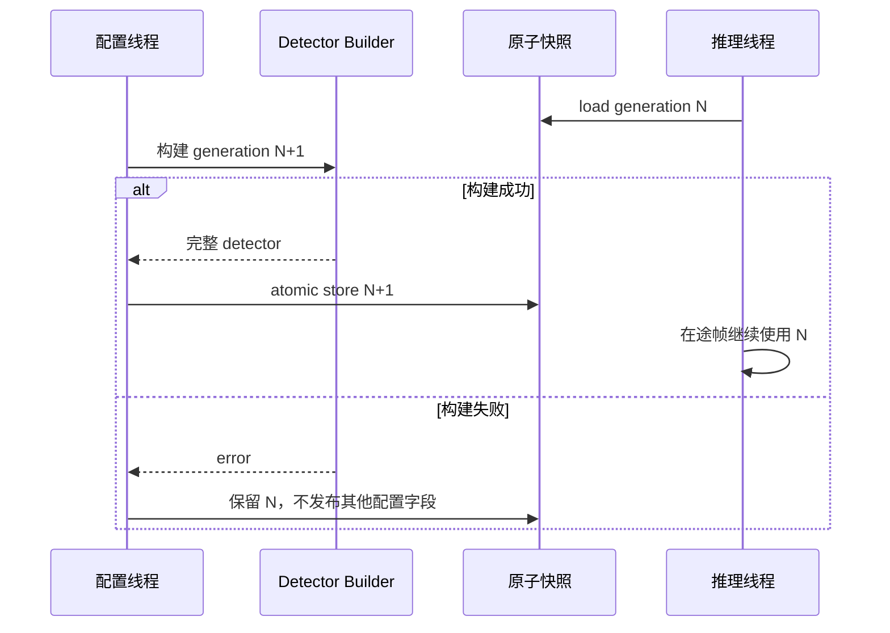

# media_agent 架构重构实施与验证记录

## 1. 文档目的

本文记录依据《媒体代理及算法模块完整目标架构设计》执行的代码迁移、模型包升级、交叉编译和 EIC7700 板端验证。本文只描述本轮已经实现或已明确进入后续阶段的内容；“编译通过”“硬件能够运行”和“数值精度通过”分别给出结论，不混为一谈。

测试环境：

| 环境 | 地址 | 工作目录 | 用途 |
|---|---|---|---|
| 量化服务器 | 192.168.88.91 | `/home/cdky/workspace/gitlab/vision-pipeline` | 模型、量化产物、pkg 生成和 PyTorch 基线 |
| 交叉编译服务器 | 192.168.88.92 | `/home/cdky/workspace/github/cross-proj` | SDK_VERSION=202606 RISC-V 编译 |
| EIC7700 开发板 | 192.168.88.127 | `/home/ubuntu/workspace/test/media_agent_refactor_phase1` | 隔离部署与板端测试 |

生产安装目录和板端系统文件均未修改。

## 2. 本轮迁移范围与阶段状态

| 阶段 | 实施结果 | 状态 |
|---|---|---|
| 0 正确性基线 | VDEC 帧归还、有限重试、有界队列、scheduler drain、逆序停止 | 完成，板端验证 |
| 1 三阶段与类型化结果 | 硬件前处理、NPU runtime、后处理插件边界；`ModelResult`；EdgeInfer 兼容门面 | 完成 |
| 2 ModelService 与去重 | 内容摘要 ModelKey、进程级共享 executor、同帧重复 pkg 只执行一次、事件按模型来源路由 | 完成，板端验证 |
| 3 快照和跨任务共享 | 检测器/配置不可变快照、构建后原子提交、失败保留旧版本 | 完成本轮同步接口范围；完整异步 GraphExecutor 留待后续 |
| 4 模型扩展 | YOLOv26 detect、YOLOv8 pose、YOLOv8 cls；face/plate 类型和插件名预留 | detect/pose 通过；cls 接入完成但固定样本数值未验收 |
| 5 吞吐优化 | SDK 并发入口保护、受控 NPU in-flight、池化输出；不盲目放大并发 | 基础完成；长期多流矩阵待独立压测 |

本轮没有把 `pipeline_20260630` 的 Element 框架整体复制进 media_agent，也没有一次性改动平台协议。现有协议先经兼容层归一化，业务行为可以分阶段回滚。

## 3. 实施后的核心结构

```mermaid
flowchart LR
    Platform["平台任务配置"] --> ConfigQueue["配置批次队列"]
    ConfigQueue --> Snapshot["不可变 Stream/Detector Snapshot"]
    RTSP["RTSP Pull"] --> VDEC["EIC VDEC"]
    VDEC --> Scheduler["有界公平 InferScheduler"]
    Snapshot --> Detector["AlgoDetector"]
    Scheduler --> Detector
    Detector --> Edge["EdgeInfer 兼容门面"]
    Edge --> Service["进程级 ModelService"]
    Service --> Executor["每模型单一执行 Lane"]
    Executor --> Plugin["ModelPlugin Registry"]
    Plugin --> VPS["DMA/VPS 前处理"]
    VPS --> NPU["EIC7700 NPU"]
    NPU --> Typed["类型化后处理"]
    Typed --> Result["ModelResult by ModelKey"]
    Result --> Event["Tracker / Event 路由"]
    Result --> OSD["公开检测框 / SEI"]
```



关键所有权规则如下：

- `StreamContext` 不拥有私有 NPU model，而是持有不可变 detector generation；
- `ModelService` 按 pkg 内容 SHA-256、设备和执行后端组成 ModelKey；
- `ModelExecutor` 的加载、推理、销毁固定在同一 worker 线程，满足当前 EIC7700 runtime 的线程亲和约束；
- 每条模型 lane 按官方 `pipeline_20260630/NpuContextUtils` 顺序执行 `SetDevice → CreateContext → SetCurrentContext → LoadModel`，不再错误地把 Device/Context 作为进程级一次性状态；
- 同一帧中多个事件引用相同模型内容时，只产生一个 executor 请求，结果通过 `source_aliases` 路由给各事件；
- detector 快照在新实例完整构建成功后才原子发布，旧 generation 由在途帧自然持有并回收；
- detect、pose、classification、face、plate 使用 variant payload，不再把非检测结果压成 bbox。

## 4. 主要代码改造

### 4.1 VDEC、队列和停止状态机

- VDEC 输入、输出队列均有硬上限；满队列采用明确丢弃策略并可统计；
- `BUF_FULL` 改为有限次数重试，防止永久占住推理线程；
- 记录已创建的 VDEC/VB/SYS 资源，失败路径只释放实际获得的资源；
- 用 in-flight 计数和条件变量等待已取出的帧完成归还；
- stream 停止顺序为：停止接单、drain scheduler、停止发布、销毁 detector/NPU lane、最后停止 VDEC 和释放 SDK runtime。

### 4.2 推理组件拆分

`third_party/algorithm/eic7700Infer/model` 新增：

- `PackageWorkspace`：解密 pkg 到独立临时目录并校验生命周期；
- `ModelKey`：以包内容摘要为主键，不依赖路径字符串；
- `ModelService`：进程级 weak registry，复用仍存活的 executor；
- `ModelExecutor`：容量为 1 的有界请求队列和线程亲和执行 lane；
- `ModelPluginRegistry`：按 `model_type` 创建插件；
- `DetectionPlugin`、`PosePlugin`、`ClassificationPlugin`；
- face detection/embedding、plate detection/recognition 的类型和计划插件入口。

`EdgeInfer` 保留原接口供 media_agent 使用，但内部返回：

```text
ModelResult {
  model_key, source_path, source_aliases,
  task_type, status, frame_id, timestamp_ms,
  payload: Detection | Pose | ClassScore | Face | Plate,
  diagnostic
}
```

FrameId 和时间戳在 media_agent detector 边界补齐，避免 algorithm 反向依赖媒体传输结构。

### 4.3 事件共享与路由

- 一个 StreamConfig 中相同 pkg 路径或不同路径但内容摘要相同的模型绑定被合并；
- `EventPostStep` 不再消费所有检测框，而是按事件原始模型路径或 alias 选择对应 `ModelResult`；
- tracker id 在检测结果到事件结果的转换中保留；
- pkg 的 `class_names` 是推理公开输出 allowlist，事件的 `target_labels` 仅用于规则判断，两者不再互相覆盖。

### 4.4 热更新与配置并发



`StreamConfig` 也通过 `shared_ptr<const StreamConfig>` 原子发布。pull callback、publish、record、snapshot、模型更新回调只读各自取得的快照，不再与配置线程直接读写同一个 protobuf 对象。

## 5. 模型包契约与生成结果

### 5.1 area-intrusion / COCO

在 91 服务器重新生成：

```text
weights/eic7700_platform/area-intrusion/coco_detect_eic7700_2_0.pkg
SHA-256: 7ec726735d0a15c31ea9472f8430768e8ff16ffe5ccb232af3a1ffa468a2a363
```

配置契约：

- `schema_version=2.0`
- `model_id=coco-detect-eic7700`
- `model_family=yolov8`
- `task_type=detection`
- `plugin=yolov8_det`
- `public_output_policy=class_names_allowlist`
- `class_names` 为稀疏字典，只保留 `0:person, 2:car, 5:bus, 7:truck`

打包脚本的 `--force` 已修正为只覆盖当前目标，不会删除整个输出根目录。原 1.3 包保留。

### 5.2 YOLOv26 PPE

使用 `ppe_safety_detect_eic7700_1_1.pkg`。板端实际 ABI 为 6 个输出，三个 stride 上分别为 4 通道框和 11 通道类别。为该 ABI 新增 CPU 后处理，不复用 YOLOv8 DFL 解码。

### 5.3 YOLOv8 Pose

生成 2.0 契约的 `yolov8_pose_pose_eic7700_1_2.pkg`，SHA-256：

```text
1d19cd82607ab6a29c016a31e281f84c30ad45014d64d2cc4780e10d6a7ede75
```

板端输出为 9 个 raw tensor：三个 stride 各包含 64 通道 DFL box、1 通道 person logit、51 通道关键点。后处理执行 DFL、类别 Sigmoid、17×3 keypoint 解码、NMS 和反 letterbox。

### 5.4 YOLOv8 Classification

分类插件、1000 类类型化输出和 top-k 已实现，模型可在 NPU 上稳定加载和执行。根据官方 DSP 配置，int8 输出按 `softmaxScale=0.188668` 反量化后执行 Softmax；分类还具有独立的 RGB 平面转换和短边中心裁剪契约。固定样本仍未与 PyTorch 对齐：PyTorch 原图 Top-1 为 `eel`，板端视频化样本结果不是同一类别。因此当前状态是“插件/硬件路径通过，量化数值未签收”，不能用于业务告警；后续必须在 91 服务器对量化输入 bin、中间层或原始输出进行逐级比对，不能继续用后处理猜测掩盖问题。

## 6. 硬件支持清单审查

`model_op_list_20260630.xlsx` 的 op 页包含 Conv、Resize、Sigmoid、Softmax、TopK、NMS 等 119 项；model 页共 59 项，明确列出 YOLOv26 n/s 640 和 YOLOv8s 640。清单没有单独列出 YOLOv8 Pose/Cls 整模型，因此采用以下准入原则：

1. YOLOv26 视为官方模型级支持，但仍做板端 ABI 和结果验证；
2. Pose/Cls 不能仅凭算子存在宣称整模型支持，必须完成 ONNX 输出审计、板端加载、固定样本数值对齐；
3. face 与 plate 只预留 schema/registry，不在没有模型包和标注集时伪造实现。

## 7. 编译、部署与验证记录

### 7.1 交叉编译

在 92 服务器的 SDK_VERSION=202606 容器中执行：

```bash
docker exec cross-proj-202606-cdky bash -lc '
  cd /workspace/proj/media-agent/third_party/algorithm &&
  ./scripts/build.sh --target riscv64 --jobs 16 --install
'

docker exec cross-proj-202606-cdky bash -lc '
  cd /workspace/proj/media-agent &&
  ./scripts/build.sh --target riscv64 --jobs 16 --install
'
```

两条命令均成功。algorithm 和 media_agent 的安装产物都位于各自 `build-riscv64/install`，没有安装到 `/opt`。

### 7.2 板端隔离部署

测试文件位于：

```text
/home/ubuntu/workspace/test/media_agent_refactor_phase1
```

动态库通过该目录和其 `lib` 子目录加载；测试未替换系统库。

### 7.3 已完成的板端用例

| 用例 | 观察结果 | 结论 |
|---|---|---|
| 单流 COCO detect 45 s | 约 30 FPS，正常告警，干净退出 | 通过 |
| 两流同 pkg | 日志仅创建一个 ModelExecutor，第二路复用；两路运行正常 | 跨任务共享通过 |
| 单流两个事件同 pkg | 请求模型数 2，实际 binding 1；事件按 alias 路由 | 同任务去重通过 |
| 单流两个事件两个 pkg | COCO + YOLOv26 分别创建 executor；`model_count=2, process_live_models=2`；完成推理和回收 | 多模型生命周期通过 |
| 模型版本热更新 | version 1→2，提交 detector generation 2；更新前后约 30 FPS | 原子切换通过 |
| YOLOv26 PPE 200 帧 | 7.493 s，26.69 FPS，有合理检测 | 硬件流推理通过 |
| YOLOv8 Pose 固定样本 | 板端 1 人、0.861；PyTorch 1 人、0.906；框和 17 点整体一致 | 数值路径通过，需扩大样本集 |
| YOLOv8 Cls 固定样本 | int8+Softmax、RGB、中心裁剪路径均稳定执行，但 top-k 与 PyTorch 未对齐 | 接入通过，精度签收失败 |

多模型测试首先暴露并修复了 SDK 生命周期错误：旧封装只在进程第一次加载模型时调用 `ES_NPU_SetDevice`，且在加载模型后才创建 Context，导致第二模型 `ES_NPU_LoadModelFromFile` 返回 `0xa00f6048`。修复后直接双模型工具测试返回 0，完整 media_agent 协议测试成功创建两个 executor 并干净退出。

隔离测试使用 `--no-output` 时还修复了 publish loop 的空 URL 行为：只有配置快照中的 `new_rtsp_url` 非空才调用 publisher，最终回归 `publisher write failed` 计数为 0。长本地 MP4 会被 demux 以非实时速度快速读完，因而该场景的瞬时 recv/dec 数值和 EOF 重连不作为实时吞吐结论；实时吞吐仍以 RTSP 或节流输入压测为准。

最终交叉编译产物摘要：

```text
media_agent:                 b01296137b0a96d8704f52f6d2796c05a288a5990c9f7f7eb49d53223564b8f1a
libcdky_eic7700_infer.so:    f9e86a8020517718952586e9de8accb5d5fb7192c1c7f6d96a39a42e392b2e91
platform simulator (riscv): 36d3bd432629ad4af030298b6303b88117e6c7a6daf87da336ffa915d06d7db8
```

板端最终隔离目录为 `/home/ubuntu/workspace/test/media_agent_refactor_phase1/final`，日志保存在其 `logs` 子目录。

## 8. 当前限制与下一步

本轮已建立可持续扩展的边界，但尚未宣称完整目标架构全部完成：

- `AlgorithmService.submit` 仍由 media_agent 同步调用；per-model deadline/cancel 和真正异步 DAG 留待下一阶段；
- executor 已有容量 1 的硬上限和跨流公平入口，但 queue wait、VPS/NPU/postprocess 分段时延还需补充指标；
- Classification 必须先完成 descriptor、output buffer 和官方 `softmaxScale` 的定点对齐；
- Pose 需在多人、遮挡、不同分辨率数据集上和 PyTorch/ONNX 统计 OKS 或关键点误差；
- YOLOv26 需补固定图片的量化前后 mAP/框差异报告；
- face/plate 需获得模型、量化配置、类别/字符表和标注集后再实现插件；
- 25 路压力测试应在上述数值回归稳定后执行，采集 NPU/VPS/DSP 利用率、MMZ/VB 水位、队列等待、丢帧率和 P95/P99 延迟。

这些限制是明确的验收门槛，而不是用“程序未崩溃”替代算法正确性。

## 9. 2026-08-19 最新代码同步后的重新实施

### 9.1 新基线与迁移原则

`media_agent` 已同步到远程最新基线：

```text
79b7ef5  2.0.1: 重构 eswin 解码器
```

该版本已经把旧 `stream/EsDecoder` 调整为 `decoder/AsyncVideoDecoder + decoder/EsDecoder`，因此上轮阶段 0 文件不能整体覆盖。本轮采用逐项迁移：

1. 保留 `79b7ef5` 的解码器和断线处理；
2. 把 scheduler admission/drain、类型化结果、ModelKey 去重、事件按模型来源路由移植到新接口；
3. detector 热更新改为不可变 generation 原子发布，构建失败保留旧版本；
4. algorithm 子仓库现存的 `ModelService/ModelExecutor/ModelPluginRegistry` 作为迁移基础，不重新复制旧目录。

准备完成但因本地 `proj` ACL 阻塞、尚未落回源码目录的文件保存在：

```text
.codex-tmp/media-agent-recovery/src/
.codex-tmp/media-agent-refactor-recovery-files.tar
```

其中包含适配新基线的 `StreamTypes`、`Detector`、`EventPostStep`、`InferScheduler`、`Pipeline` 和 `PipelineConfig`。这部分在写权限恢复后必须先执行 diff 审查，再进入交叉编译；当前不能标记为“源码迁移完成”。

### 9.2 本地权限阻塞与恢复边界

本地 `proj/media-agent` 目录的 Windows ACL 没有给当前 Codex 沙箱继承写权限，并残留 `NULL SID` 的显式拒绝项。补丁工具不能以“临时文件 + 原子替换”方式写入。一次补丁尝试后以下三个原本干净文件在工作树中显示为删除：

```text
src/detector/AlgoWorkflow.h
src/detector/Detector.cpp
src/pipeline/StreamTypes.h
```

Git 对象没有丢失；原始文件已归档到：

```text
.codex-tmp/media-agent-head-recovery.tar
```

恢复归档的 SHA-256 校验值如下，后续恢复前应先校验，避免使用不完整归档：

```text
media-agent-head-recovery.tar
FB4F1847315F61DAF2EC5E73C13181659441641B2FA842D5FF76B9EDCE0F072D

media-agent-refactor-recovery-files.tar
5F1F94F7A30888C069B111E78A7A1B45714D75C212D0E0D7F1244CC4D7F67FC3

media-agent-baseline-files.tar
792237410C89A578F2AC5B9E21AE4D684BE21466C731F9A31732E106E7452A18
```

在权限恢复前禁止继续对该工作树执行 `git apply/restore/checkout`，避免删除更多文件。权限恢复后的第一步应从 `HEAD` 恢复上述三个文件，然后审查 recovery tree 中的目标改动。该阻塞只影响本地源码落盘；本节后续的 SDK/工具链分析均为只读完成。

## 10. YOLOv26、YOLOv8 Pose/Cls 的 SDK 后处理能力复核

### 10.1 不能把“算子存在”当作“模型后处理已支持”

官方 `model_op_list_20260630.xlsx` 包含 `es_bbox_decoder`、`es_detection_out`、`es_nms`、`es_softmax`、`es_topk` 等算子，也列出 YOLOv26n/s 和 YOLOv8s 的若干输入规格。该清单只证明编译器/NPU 的算子或整模型样例覆盖，不能证明 SDK 已提供对应任务的 DSP 后处理 ABI。

官方 `pipeline_20260630/src/elements/postprocessElement` 给出了更直接的运行时证据：

- `EsPostNetWorkName` 只包含 YOLOv3、YOLOv4、YOLOv5、YOLOv7、YOLOv8、SSD、FRCNN；没有 YOLOv26；
- 检测硬件路径调用 `ES_AK_DSP_DetectionOut`，网络枚举和输入 tensor ABI 必须严格匹配；
- 分类硬件路径明确调用 `ES_AK_DSP_Softmax` 和 `ES_AK_DSP_Argmax`；
- 姿态硬件路径是 RTMPose 的 SimCC 解码，输入、输出和 YOLOv8 Pose 的 3 个 stride、9 路 raw tensor 完全不同。

据此得到三种模型的准入矩阵：

| 模型 | NPU 模型编译 | 官方硬件后处理 | 本工程应采用的后处理 |
|---|---|---|---|
| YOLOv26 PPE | 清单列出 YOLOv26s 640×640，仍需当前自训练模型实测 | **不支持 YOLOv26 DetectionOut** | CPU 解析 3×`ltrb + class logits` 六输出并做 NMS；不可伪装成 YOLOv8 DSP |
| YOLOv8 Pose | 清单没有单列 Pose 整模型，只能按算子和实测准入 | **不支持 YOLOv8 Pose；RTMPose 不是替代 ABI** | CPU DFL、bbox、17×3 keypoint 解码和 NMS |
| YOLOv8 Cls | 单输出分类图可由 NPU 编译，需固定样本验收 | **支持 DSP Softmax + Argmax** | DSP 为主、CPU Softmax/TopK 回退；两路径必须逐元素/TopK 对齐 |

### 10.2 现有量化产物为什么不能直接签收

本地镜像中的三个现有目录只保留 `.model/.pkg/runtime json/table.json`，均缺少本次可追溯验收需要的 `esquant/config.json`、源 ONNX、`preprocess.json`、校准图片清单和量化误差报告。实际输出 ABI 为：

| 模型 | `table.json` 输出 | dtype | 与当前 CPU 插件关系 |
|---|---:|---|---|
| PPE YOLOv26 | 6：3 个 cv2 框 + 3 个 cv3 类别 | int8 | 结构匹配，但量化来源、预处理和精度不可追溯 |
| YOLOv8 Pose | 9：3×cv2、3×cv3、3×cv4 | int8 | 结构匹配 CPU Pose 插件 |
| YOLOv8 Cls | 1：`output0` | int8 | 结构匹配分类插件，但上轮固定样本 Top-1 与 PyTorch 不一致 |

因此结论不是“模型文件不能加载”，而是“缺少可重复量化证据，不能作为业务版本签收”。三个模型都应重新量化；Classification 因已有数值反例，优先级最高。

### 10.3 量化工具链中发现的契约问题

当前 `eic7700_pipeline.py` 对所有 `task_type=detect` 都生成：

```text
backend = ES_AK_DSP_DetectionOut
network = yolov8
input_tensor_count = 3
box_encoding = DFL
```

这对 YOLOv26 是错误的：当前 PPE 模型是六输出、4 通道 ltrb distance，不是三路 `64+class` 的 YOLOv8 DFL 融合头。若不先修复，pkg manifest 会把不能执行的硬件路径声明成正式契约。

本轮已在 recovery tree 中准备以下工具链修正，待权限恢复后迁入 `vision-pipeline`：

```text
.codex-tmp/vision-pipeline-recovery/platforms/eic7700/quantize/eic7700_pipeline.py
```

修正内容：

- YOLOv26 manifest 固定为 `cpu + yolov26_raw_6`，编译后强校验 3×cv2/cv3 和量化 scale；
- YOLOv8 Pose 固定为 `cpu + yolov8_pose_raw_9`，强校验九输出；
- YOLOv8 Cls 固定为 `classification_logits_1`，声明 DSP Softmax/Argmax 和 CPU fallback；
- 为 detect/pose/cls 分别写入明确的预处理契约；Classification 使用 RGB、短边缩放、中心裁剪、NCHW；
- 禁止只凭 `.model` 生成成功就更新 runtime json。

该 recovery 脚本已通过 Python 语法检查，但尚未在 91 服务器容器中执行，不能替代真实量化验证。

recovery tree 与最新基线的静态差异检查已通过：媒体代理迁移涉及 9 个文件（227 行新增、98 行删除），量化脚本涉及 87 行新增、12 行删除；检查未发现空白错误。该结果只说明补丁文本结构可用，不代表 C++ 已经通过交叉编译。

### 10.4 重新量化和数值验收流程（待 91 连通后执行）

YOLOv8 Pose/Cls 可使用统一脚本重新导出 raw ONNX、校准、编译和模拟：

```bash
cd /home/cdky/workspace/gitlab/vision-pipeline
bash scripts/yolov8/quantize_eic7700.sh \
  --tasks yolov8_pose,yolov8_cls \
  --calib-count 200 \
  --analysis-count 20 \
  --analyse \
  --simulate \
  --force-raw
```

PPE 必须先审计 `weights/train/ppe_safety` 中 PT/ONNX 的真实 export 输出，确保生成六路 raw head，再执行：

```bash
bash platforms/eic7700/quantize/run_all.sh \
  --task ppe_safety \
  --model-type yolov26_det \
  --onnx /workspace/weights/eic7700/ppe_safety/<已验证六输出>.onnx \
  --imgsz 640 \
  --calib-count 200 \
  --analysis-count 20 \
  --no-yolov8-raw-outputs \
  --analyse \
  --simulate
```

三阶段验收必须使用同一批固定图片和同一预处理：

1. PyTorch FP32 与 ONNXRuntime FP32 对齐；
2. EsQuant quantized ONNX/EsSimulator 与 FP32 对齐；
3. 开发板 NPU raw tensor 与模拟器对齐，再分别验证 CPU/DSP 后处理。

Classification 还需单独比较：原始 int8 logits、按 `table.json` scale 反量化结果、CPU Softmax Top-5、DSP Softmax+Argmax Top-5。若 logits 已偏离，问题在预处理/量化；若 logits 对齐而 TopK 不同，问题才在后处理。禁止继续只看最终类别名称猜测原因。

## 11. 本轮尚未完成的执行项

由于当前执行环境同时存在两个硬阻塞，本轮不能形成新的编译/板端通过结论：

- 本地 `proj/media-agent` ACL 阻止源码安全写入；
- 当前沙箱禁止访问 192.168.88.91/92/127，SSH 在创建套接字阶段返回 `WinError 10013`。

权限和内网连通恢复后继续顺序固定为：恢复三个文件 → 迁入并审查 recovery 改动 → 91 重新量化和三阶段数值验收 → 92 交叉编译 → 127 隔离部署 → 单模型、多模型共享、热更新、长稳和 25 路指标测试。此前第 8 节中的 Classification、异步 deadline/cancel、分段指标和 25 路压测仍然是未完成项，不能因本次只读分析而关闭。

## 12. 2026-08-19 权限恢复后的继续实施

### 12.1 最新基线迁移落盘

本地 ACL 恢复后确认 `media-agent` 目录已经重新启用继承，三个受失败补丁影响的文件也已从 `HEAD` 恢复。恢复树中的九个目标文件与 `79b7ef5` 基线逐文件比较，在忽略 CRLF/LF 后完全一致，因此将以下能力迁入最新代码：

- `FrameInferenceResult` 保留类型化 `model_results`，检测兼容层只把 Detection payload 转换成旧 `objects`；
- 事件模块按 `model_config_name`、basename/stem 和 alias 查找对应 `ModelResult`，每个事件只消费其绑定模型的检测结果；
- scheduler 删除流时先关闭 admission，再等待在途帧 drain；
- detector 使用不可变 generation 和 `atomic_load/atomic_store` 发布，逐帧路径不持有更新锁；
- 热更新先完整构建新 detector，失败时保留旧 generation，成功后再提交 runtime config。

工具链同时补充 YOLOv26/Pose/Cls 的任务级 ABI 和预处理契约，并修复 `--force-raw` 只绕过 shell 缓存、却没有向 Python 传递 `--force-onnx` 的问题。

### 12.2 交叉编译修复与结果

首次从宿主机执行失败，是因为 `/opt/riscv` 只存在于 `cross-proj-202606-cdky` 容器。切回 SDK_VERSION=202606 容器后又暴露 `FindProtobuf.cmake` 的既有设计错误：交叉编译时要求目标架构 `protoc`，但 `.proto` 代码生成发生在构建机，正确组合应为“宿主机 protoc + 目标 sysroot 的 libprotobuf”。仓库已有 `FindProtobuf.cmake_mine` 保存了这一修正，本轮将其语义迁入正式文件。

最终在 92 执行：

```bash
docker exec cross-proj-202606-cdky bash -lc '
  cd /workspace/proj/media-agent &&
  ./scripts/build.sh --target riscv64 --jobs 16 --clean --install
'
```

配置、编译和安装全部成功；`media_agent`、`libcdky_eic7700_infer.so`、`libcdky_track.so`、`libcdky_event.so` 及其运行库进入 `build-riscv64/install`。CMake 仍提示 bundled FFmpeg 与 sysroot FFmpeg 可能发生运行时搜索顺序冲突，板端部署必须通过隔离目录和明确的 `LD_LIBRARY_PATH` 验证实际加载路径。

### 12.3 YOLOv26 DSP 后处理最终确认

在 127 开发板直接检查 `/usr/include/essdk/es_nn_common.h`。当前 `ES_DET_NETWORK_E` 包含：

```text
yolov3/4/5/6/7/8/9/10/11
yolov8pose, yolov8seg, yolov8obb
yolox, yolonas, ppyoloe, detr, ssd, frcnn 等
```

枚举中没有 YOLOv26。板端 `libes_accelerator_kit.so.2` 确实导出 `ES_AK_DSP_DetectionOut`，但该函数必须接收上述网络枚举，其存在不能证明任意新模型都能使用 DSP DetectionOut。

PPE checkpoint 的实际 Detect head 已确认：`nc=11`、`nl=3`、`reg_max=1`、stride 为 8/16/32、`end2end=false`，输出契约是三组 `box[4] + class[11]`。它既不是 YOLOv8 的三路 DFL16 融合 tensor，也不能冒充 YOLOv10/11。因此当前 SDK 下的正式实现是：

```text
VDEC/VPS 硬件前处理 → NPU YOLOv26 推理 → CPU ltrb/Sigmoid/NMS 后处理
```

如需 DSP 化，必须获得厂商新增的 YOLOv26 network enum 与 DetectionOut ABI，或开发独立 DSP kernel，并用同一组 raw tensor 对 CPU/DSP 的框、类别、分数逐项回归。禁止只替换枚举值后宣称支持。

### 12.4 重新量化状态

91 的 `cdkyvison-cdky` 容器可以加载三个源 PT：PPE 为 11 类 Detect、Pose 为官方 YOLOv8 Pose、Cls 为官方 YOLOv8 Classification。Pose/Cls 各有不少于 200 张校准图；PPE 数据目录只有 41 张，不能伪造 200 张校准覆盖。

Pose/Cls 已在覆盖前归档旧目录，并使用强制重新导出 raw ONNX、200 张校准、20 张误差分析和 EsSimulator 的流程启动重量化。PPE 导出器已进一步修正：YOLOv26 保留六路 raw tensor，YOLOv8 Detect 仍生成 DSP DetectionOut 所需的三路融合 tensor。PPE 重量化只能按现有 41 张执行并标记数据覆盖不足，或在补齐校准集后重新签收。

### 12.5 Pose/Cls 重量化结果与工具链二次修正

Pose 的 EsQuant 输出为 9 路 int8 tensor，编译 JSON 最终 `EVENT_SINK` 也有 9 路输入。EsAAC 202606 生成的 `ofmap_order.txt` 只列出三个 cv2 输出，但编译图中 cv2/cv3/cv4 九个终端节点均汇入 `EVENT_SINK`，NPU 运行时按模型元数据返回九路输出。因此产物校验已改为检查编译 JSON 的终端契约、各 head 节点和量化 scale，不能再把不完整的辅助顺序文件误判为模型缺输出。Pose 量化误差报告中三个 score Sigmoid 的 cosine 分别约为 `0.97370/0.98677/0.98333`，仍需板端固定样本和多人数据集回归。

Classification 编译图确认包含 DSP `softmax` 内核，单输出 scale 完整；量化误差报告中 Softmax cosine 为 `0.99933`。这表示 Ultralytics 导出的图已经返回概率，不能再把输出声明为 logits 并在 CPU 做第二次 Softmax。runtime 契约已修正为“图内 DSP Softmax + CPU TopK”；当前 algorithm 尚未调用外置 `ES_AK_DSP_Argmax`，因此不能写成 DSP Softmax/Argmax 全硬件路径。重跑同时发现旧脚本把 100 类校准子集目录当成官方 ImageNet 模型的类别表，造成 1000 维模型的 runtime JSON 只有 100 个名称，并因旧模型文件残留而选择 `cls100` 模型名。现已改为在训练容器中从 PT checkpoint 读取权威类别表，写入 ONNX 同名 `metadata.json`，后续量化阶段优先读取该元数据；编译产物选择优先匹配 runtime 中的精确模型名。修正后的 JSON 已确认：

```text
num_class=1000
class_names.size=1000
model_name=yolov8_cls_cls_cls1000_external_224_eic7700.model
score_activation=probability
postprocess.backend=compiled_graph_softmax_cpu_topk
postprocess.softmax_backend=compiled_dsp
postprocess.topk_backend=cpu
cpu_fallback=true
```

当前 EsAAC 镜像没有 `/home/eswin/EsSimulator`，脚本已明确记录并跳过模拟器步骤。因此上述结果只完成“量化报告 + 编译 ABI”验收，最终数值签收仍以板端固定样本对 PyTorch/ONNX 的 Top-5 和关键点误差为准。

### 12.6 最新交叉编译与板端隔离回归

空输出 URL 修复后的 `media_agent` 已在 92 的 202606 容器增量编译成功，并更新到板端隔离目录：

```text
/home/ubuntu/workspace/test/media_agent_refactor_20260819
```

旧二进制保存为 `media_agent.before-empty-output-fix`。对 `rtsp://192.168.88.91/live/test1`、COCO pkg、区域入侵事件执行 75 秒回归，结果为：14 个告警、7 次心跳、14 个稳定约 25 FPS 的统计周期、`publisher write failed=0`，收到 SIGINT 后 VDEC group 和全局 VDEC 均正常释放，进程干净退出。该结果验证了无输出地址时不再调用发布器，同时没有影响解码、推理和事件链。

随后通过平台模拟器把同一配置的 `model_version` 从 1 提升到 2 并重新下发。media_agent 收到 `config_id=2` 后提交 `detector generation=2`，更新前后推理保持运行，证明不可变 generation 的原子切换路径生效。

多事件第一次复测失败的根因不是 CSV 解析，而是 `--enabled-only` 与“第一路覆盖”的索引语义不一致：模拟器修改了模板数组第 0 项，实际过滤后下发的第一路却是 `stream-026`，因此板端仍收到模板中的单事件配置。模拟器现已改为在 `--enabled-only` 模式下覆盖第一条 enabled 配置，并在启动时打印最终下发流、事件、pkg 和版本摘要。修复后，同 pkg 双事件、双 pkg 双事件和版本热更新均已完成有效复测，完整过程见 12.8 节。

### 12.7 YOLOv26 本轮重量化输入契约

PPE 旧目录已归档为：

```text
weights/backups/ppe_safety_before_requant_20260819.tar.gz
SHA-256: 110c1d2a2ef300830dae115f1a28662f984de754a61b51828e6264fd965e0819
```

从 `ppe_safety_detect_cls11_yolo26s_640.pt` 强制重新导出后，raw ONNX 已实证为六输出：

```text
stride 8 : box [1,4,80,80]  + score [1,11,80,80]
stride 16: box [1,4,40,40]  + score [1,11,40,40]
stride 32: box [1,4,20,20]  + score [1,11,20,20]
```

这再次排除了 YOLOv8 DFL16 三输入 DSP DetectionOut ABI。量化使用现有全部 41 张校准图、20 张分析图执行；由于样本量不足目标 200 张，即使编译和板端测试通过，也只能标记为工程可运行版本，不能标记为最终精度签收版本。

### 12.8 使用 91 Go 环境模拟平台任务下发的完整过程

#### 12.8.1 执行拓扑和边界

本次“在 91 上进行模拟下发”的准确含义是：

```text
本地最新 media-agent/tests 与 protobuf 源码
              │
              ▼
91：使用系统 Go/protoc 生成 pb.go、执行 Go 测试、交叉编译 RISC-V media-server
              │ 复制 RISC-V 静态二进制
              ▼
127：media-server 通过 Unix Domain Socket 向同机 media_agent 下发配置
              │
              └── RTSP 输入 rtsp://192.168.88.91/live/test1 由 91 提供
```

`media_agent` 的平台配置通道是 Unix Domain Socket，不是 TCP。Unix socket 不能跨主机访问，因此 Go 源码和构建环境位于 91，但 RISC-V 模拟器必须与 media_agent 一起运行在 127。不能把 91 上直接运行 amd64 `media-server` 描述成向 127 的 Unix socket 下发任务。

本轮使用的固定位置为：

```text
91 构建目录：/home/cdky/workspace/gitlab/vision-pipeline/.codex-tmp/media-agent-platform-simulator-20260819-2
127 测试目录：/home/ubuntu/workspace/test/media_agent_refactor_20260819
127 socket：  /tmp/media_agent_refactor_20260819.sock
模拟 RTSP：   rtsp://192.168.88.91/live/test1
```

#### 12.8.2 从本地同步模拟器源码到 91

模拟器依赖 `tests` Go module 和 media-agent 的三份协议源文件，二者必须来自同一次代码快照。不要只复制 `server.go`，否则 Go 协议类型可能与 C++ media_agent 不一致。

在本地 `cross-proj` 根目录执行：

```powershell
tar -czf .codex-tmp/media-agent-platform-simulator-20260819.tar.gz `
  -C proj/media-agent `
  tests third_party/protocol/protobufs/media-agent

Get-FileHash `
  .codex-tmp/media-agent-platform-simulator-20260819.tar.gz `
  -Algorithm SHA256

scp .codex-tmp/media-agent-platform-simulator-20260819.tar.gz `
  cdky@192.168.88.91:/tmp/
```

本轮上传包的 SHA-256 为：

```text
2d573b320902c3ae0010c85452e10d4ef2f6f1aa385eab14d8f409ee29eeee1c
```

#### 12.8.3 在 91 生成 protobuf、测试并交叉编译

91 已安装：

```text
/snap/bin/go    go1.26.5 linux/amd64
/usr/bin/protoc libprotoc 3.12.4
```

在 91 执行：

```bash
set -euo pipefail

STAGE=/home/cdky/workspace/gitlab/vision-pipeline/.codex-tmp/media-agent-platform-simulator-20260819-2
mkdir -p "$STAGE"
tar -xzf /tmp/media-agent-platform-simulator-20260819.tar.gz -C "$STAGE"

cd "$STAGE/tests"
mkdir -p "$STAGE/tool-bin" pb bin

# 固定生成器版本，避免 @latest 使协议代码不可复现。
GOBIN="$STAGE/tool-bin" \
GOPROXY=https://goproxy.cn,direct \
go install google.golang.org/protobuf/cmd/protoc-gen-go@v1.36.11

PATH="$STAGE/tool-bin:$PATH" protoc \
  --go_out=pb \
  --go_opt=paths=source_relative \
  --go_opt=Mversion.proto=bench/pb \
  --go_opt=Mtypes.proto=bench/pb \
  --go_opt=Mmedia-agent.proto=bench/pb \
  --proto_path=../third_party/protocol/protobufs/media-agent \
  version.proto types.proto media-agent.proto

gofmt -w cmd/server/main.go server/server.go
GOPROXY=https://goproxy.cn,direct go test ./server ./proto

CGO_ENABLED=0 GOOS=linux GOARCH=riscv64 \
GOPROXY=https://goproxy.cn,direct \
go build -trimpath -o bin/media-server ./cmd/server

file bin/media-server
sha256sum bin/media-server
```

本轮结果：

```text
go test ./server ./proto：通过
文件类型：ELF 64-bit LSB executable, UCB RISC-V, statically linked
SHA-256：a5e6578c660561711254ac0b5aeb5adc94d576cdbe6e8d29f34f4099fec1c554
```

这里使用 `CGO_ENABLED=0`，生成的模拟器不依赖板端 Go runtime 或额外动态库。protobuf 必须在测试目录重新生成，不能使用来源不明的旧 `pb.go`。

#### 12.8.4 将 91 产物安装到 127

可从运维机分两段复制，避免要求 91 保存 127 的登录凭据：

```bash
scp cdky@192.168.88.91:/home/cdky/workspace/gitlab/vision-pipeline/.codex-tmp/media-agent-platform-simulator-20260819-2/tests/bin/media-server \
  ./media-server-91-riscv64

scp ./media-server-91-riscv64 \
  ubuntu@192.168.88.127:/home/ubuntu/workspace/test/media_agent_refactor_20260819/bin/media-server.from91.tmp
```

在 127 校验后原子替换，保留上一版：

```bash
set -euo pipefail
BASE=/home/ubuntu/workspace/test/media_agent_refactor_20260819
cd "$BASE"

echo 'a5e6578c660561711254ac0b5aeb5adc94d576cdbe6e8d29f34f4099fec1c554  bin/media-server.from91.tmp' \
  | sha256sum -c -

cp -p bin/media-server bin/media-server.before-91-go-20260819
chmod 755 bin/media-server.from91.tmp
mv bin/media-server.from91.tmp bin/media-server
./bin/media-server --help
```

帮助中必须出现 `--socket`、`--enabled-only`、`--no-output`、`--rtsp-url`、`--model-config`、`--scenario-codes` 和 `--scenario-model`。如果没有这些参数，说明部署的仍是旧模拟器。

#### 12.8.5 板端隔离配置和通用环境

板端测试配置使用独立 socket，不能连接或删除正式服务的 `/opt/smart-guard/run/media-agent/media_agent.sock`。`config/test.yaml` 至少包含：

```yaml
log:
  level: info
  output: file
  log_dir: ./log/
  max_file_mb: 100
  max_files: 10

socket:
  socket_path: /tmp/media_agent_refactor_20260819.sock
  send_queue_size: 100
  heartbeat_interval_ms: 10000

pipeline:
  enable_algorithm: true
  num_infer_threads: 3
  statistics_interval_ms: 5000
  item_duration_ms: 200
  publish_video_packet_watermark: 10
  publish_timestamp_mode: packet
  record_format: ts

eswin_decoder:
  grpid_mode: auto

algorithms:
  event_edge:
    config_name: ./config/Event.yaml
```

每次测试先设置公共变量，并确认没有遗留进程：

```bash
BASE=/home/ubuntu/workspace/test/media_agent_refactor_20260819
SOCK=/tmp/media_agent_refactor_20260819.sock
COCO="$BASE/models/coco_detect_eic7700_2_0.pkg"
PPE="$BASE/models/ppe_safety_detect_eic7700_1_1.pkg"
RTSP=rtsp://192.168.88.91/live/test1

cd "$BASE"
mkdir -p test-logs
ps -ef | grep -E '[m]edia-server|[m]edia_agent'
rm -f "$SOCK"
```

`--enabled-only` 只下发模板中 enabled 的流，`--no-output` 清空 `new_rtsp_url`，适合只验证解码、推理和事件，不启动 RTSP 推流。模拟器启动日志必须先看到 `first dispatched stream ... algorithms=N` 以及每个 `algorithm[i]` 的事件、pkg、版本，再启动 media_agent。

#### 12.8.6 同一模型对应多个事件

启动模拟平台：

```bash
NAME=same_model_two_events_91

nohup timeout --signal=INT --kill-after=10s 70s \
  ./bin/media-server server \
  --socket "$SOCK" \
  --enabled-only \
  --no-output \
  --rtsp-url "$RTSP" \
  --model-config "$COCO" \
  --scenario-codes area-intrusion,area-loitering \
  </dev/null >"test-logs/${NAME}_server.log" 2>&1 &
echo $! >"test-logs/${NAME}_server.pid"

sleep 2

nohup sudo -n -E env \
  LD_LIBRARY_PATH="$BASE/lib:/usr/lib/riscv64-linux-gnu" \
  MEDIA_AGENT_ALGORITHM_CONFIG_DIR="$BASE/config" \
  timeout --signal=INT --kill-after=15s 60s \
  ./media_agent -c ./config/test.yaml \
  >"test-logs/${NAME}_agent.log" 2>&1 &
echo $! >"test-logs/${NAME}_agent.pid"
```

验收命令：

```bash
grep -E 'first dispatched|algorithm\[' "test-logs/${NAME}_server.log"
grep -E 'received config|algorithms=|algo\[' "test-logs/${NAME}_agent.log"
grep -E 'EdgeInfer init requested|duplicate model|init success model_count' log/cdky_algorithm.log | tail -n 20
grep -E 'type=area-intrusion|type=area-loitering' "test-logs/${NAME}_server.log"
```

本轮实测结果：模拟器与 media_agent 均显示 `algorithms=2`；两个事件均持续产生告警；`EdgeInfer init requested model_count=2` 表示收到两个事件绑定，随后出现 `bound duplicate model`，最终为 `EdgeInfer init success model_count=1 process_live_models=1`。这证明同 pkg 多事件只保留一个模型执行器，事件处理按各自配置分别执行。

#### 12.8.7 不同事件对应不同模型

```bash
NAME=two_models_91

nohup timeout --signal=INT --kill-after=10s 70s \
  ./bin/media-server server \
  --socket "$SOCK" \
  --enabled-only \
  --no-output \
  --rtsp-url "$RTSP" \
  --scenario-codes area-intrusion,helmet-detection \
  --scenario-model "area-intrusion=$COCO,helmet-detection=$PPE" \
  </dev/null >"test-logs/${NAME}_server.log" 2>&1 &
echo $! >"test-logs/${NAME}_server.pid"

sleep 2

nohup sudo -n -E env \
  LD_LIBRARY_PATH="$BASE/lib:/usr/lib/riscv64-linux-gnu" \
  MEDIA_AGENT_ALGORITHM_CONFIG_DIR="$BASE/config" \
  timeout --signal=INT --kill-after=15s 60s \
  ./media_agent -c ./config/test.yaml \
  >"test-logs/${NAME}_agent.log" 2>&1 &
echo $! >"test-logs/${NAME}_agent.pid"
```

验收命令：

```bash
grep -E 'first dispatched|algorithm\[' "test-logs/${NAME}_server.log"
grep -E 'received config|algorithms=|algo\[' "test-logs/${NAME}_agent.log"
grep -E 'model executor created|init success model_count' log/cdky_algorithm.log | tail -n 20
grep -Ei 'error|failed|fatal|exception' "test-logs/${NAME}_agent.log"
```

本轮实测确认两条算法配置分别指向 COCO 和 PPE，`EdgeInfer init success model_count=2 process_live_models=2`，两个执行器均成功创建，运行期间没有 NPU、VDEC 或 pipeline 错误，停止时两个执行器和 VDEC 均正常释放。测试画面能触发区域入侵，但没有安全帽目标，因此“未产生 helmet-detection 告警”不等于 PPE 推理未执行；该事件的精度和召回应使用包含 PPE 目标的固定样本另行签收。

#### 12.8.8 使用 FIFO 模拟模型版本热更新

直接把模拟器 stdin 重定向到 `/dev/null` 时只能做静态下发。需要后台交互更新时使用命名管道，并保持一个 writer 打开，防止单次写入后模拟器读到 EOF：

```bash
NAME=hot_reload_91
FIFO=/tmp/media_agent_refactor_20260819.control
rm -f "$FIFO" "$SOCK"
mkfifo "$FIFO"

nohup timeout --signal=INT --kill-after=10s 12h \
  ./bin/media-server server \
  --socket "$SOCK" \
  --enabled-only \
  --no-output \
  --rtsp-url "$RTSP" \
  --model-config "$COCO" \
  --scenario-codes area-intrusion \
  <"$FIFO" >"test-logs/${NAME}_server.log" 2>&1 &
echo $! >"test-logs/${NAME}_server.pid"

# 保持 FIFO 写端常驻，否则一次 printf 结束后控制协程会收到 EOF。
nohup sh -c 'exec 3>"$1"; while :; do sleep 3600; done' sh "$FIFO" \
  >"test-logs/${NAME}_fifo_keeper.log" 2>&1 &
echo $! >"test-logs/${NAME}_fifo_keeper.pid"

sleep 2

nohup sudo -n -E env \
  LD_LIBRARY_PATH="$BASE/lib:/usr/lib/riscv64-linux-gnu" \
  MEDIA_AGENT_ALGORITHM_CONFIG_DIR="$BASE/config" \
  timeout --signal=INT --kill-after=15s 12h \
  ./media_agent -c ./config/test.yaml \
  >"test-logs/${NAME}_agent.log" 2>&1 &
echo $! >"test-logs/${NAME}_agent.pid"
```

控制命令：

```bash
# model_version 加 1，并重新下发完整配置；用于验证 detector generation 热替换。
printf 'v\n' >"$FIFO"

# 只发送 AlgorithmModelUpdate 通知，不改变完整配置版本。
printf 'u\n' >"$FIFO"

# 增减启用流数量并重新下发。
printf '+\n' >"$FIFO"
printf -- '-\n' >"$FIFO"
```

热更新验收：

```bash
grep -E 'model_version|config sent|ack' "test-logs/${NAME}_server.log"
grep -E 'received config|config_id=|generation committed|detector init failed' \
  "test-logs/${NAME}_agent.log"
```

本轮自动在启动 15 秒后输入 `v`。模拟器日志为 `model_version bumped to 2`、`config_id=2` 且 ACK 成功；media_agent 收到版本 2 后记录 `detector generation committed generation=2`。更新前后告警连续，旧 detector 在新 generation 提交后释放，证明“先构建、后原子发布、再回收旧代”的路径生效。

#### 12.8.9 查询、停止、清理与最终验收

查询：

```bash
for f in test-logs/*_server.pid test-logs/*_agent.pid; do
  [ -f "$f" ] || continue
  pid=$(cat "$f")
  if kill -0 "$pid" 2>/dev/null; then
    echo "RUNNING $f pid=$pid"
  else
    echo "STOPPED $f pid=$pid"
  fi
done

ps -ef | grep -E '[m]edia-server|[m]edia_agent'
```

停止当前案例时只使用 pid 文件，不使用宽泛的 `pkill media_agent`，避免影响正式实例：

```bash
NAME=hot_reload_91

[ -f "test-logs/${NAME}_agent.pid" ] && \
  sudo kill -INT "$(cat "test-logs/${NAME}_agent.pid")" 2>/dev/null || true
[ -f "test-logs/${NAME}_server.pid" ] && \
  kill -INT "$(cat "test-logs/${NAME}_server.pid")" 2>/dev/null || true
[ -f "test-logs/${NAME}_fifo_keeper.pid" ] && \
  kill "$(cat "test-logs/${NAME}_fifo_keeper.pid")" 2>/dev/null || true

sleep 5
rm -f /tmp/media_agent_refactor_20260819.sock \
      /tmp/media_agent_refactor_20260819.control
```

最终验收至少检查以下事实：

1. 服务端摘要中的 stream、RTSP、事件数量、事件名、pkg 路径和版本与本次案例完全一致；
2. media_agent 返回 `MSG_CONFIG` 成功 ACK，并显示相同的 `config_id` 和 `algorithms`；
3. 同 pkg 多事件最终 `EdgeInfer model_count=1`，不同 pkg 多事件最终 `model_count=2`；
4. 心跳中 `success=1 failed=0`，运行日志无 NPU/VDEC/pipeline 错误；
5. `v` 更新后出现新 `config_id` 和 `generation committed`，且更新前后均有推理/事件输出；
6. SIGINT 或 timeout 结束后，RTSPPuller、Pipeline、SocketSender、模型执行器、VDEC group 和全局 VDEC 都完成释放。

本轮板端证据日志保存在：

```text
/home/ubuntu/workspace/test/media_agent_refactor_20260819/test-logs/same_model_two_events_91_server.log
/home/ubuntu/workspace/test/media_agent_refactor_20260819/test-logs/same_model_two_events_91_agent.log
/home/ubuntu/workspace/test/media_agent_refactor_20260819/test-logs/two_models_91_server.log
/home/ubuntu/workspace/test/media_agent_refactor_20260819/test-logs/two_models_91_agent.log
/home/ubuntu/workspace/test/media_agent_refactor_20260819/test-logs/hot_reload_91_server.log
/home/ubuntu/workspace/test/media_agent_refactor_20260819/test-logs/hot_reload_91_agent.log
```
