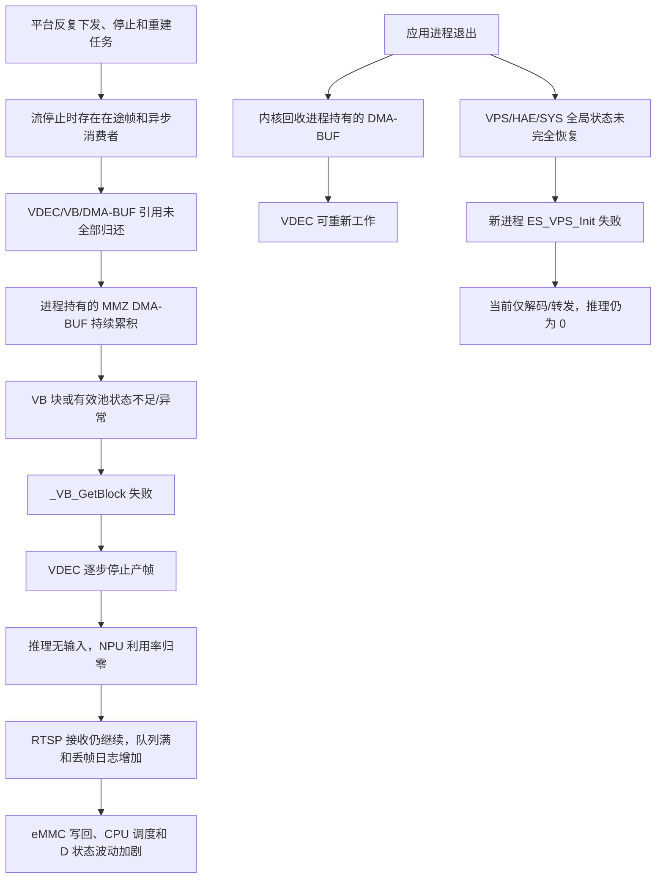

# 开发板多任务并发资源异常排查与恢复记录

> **2026-08-20 后续验证修正**：本文件第 2.3 节关于“需要整板重启”的判断已被后续 A/B 实验推翻。运行并正常结束 `pipeline_20260630` 后，未重启开发板，原 `media_agent` 的 `ES_VPS_Init` 即恢复；修正后的 `media_agent` 也已完成不依赖 pipeline 的独立停止、清理和重启。最终根因、代码修复及复测证据见《[开发板VPS恢复与多任务并发异常根因修复复测记录](开发板VPS恢复与多任务并发异常根因修复复测记录.md)》。本文保留初次现场记录，不能再把第 2.3 节作为最终恢复结论。

## 1. 文档目的与排查边界

本文记录 2026 年 8 月 20 日在 EIC7700 开发板上对 `media_agent` 多任务并发异常进行的现场排查、受控重启、持续监控和根因分析。测试程序位于：

```text
/home/ubuntu/workspace/test/media_agent
```

现场平台已经下发多路任务，因此本轮没有重新构造平台请求；只对指定目录中的进程进行检查、优雅停止和重新启动。本轮没有修改开发板系统文件，没有执行整板重启、内核模块卸载或驱动复位，也没有修改 `media_agent` 源码。

本轮重点分析以下现象：

1. 运行过程中偶发 `_VB_GetBlock: error:get block failed, errno:(22,Invalid argument)`，随后 `AlgoDetector` 推理失败。
2. 任务数大于 5 路后，CPU、NPU 等硬件利用率波动明显。
3. 长时间运行后 `/proc/esmap/dec` 的 VDEC 组停止增长，`es_hw_watcher` 中硬件利用率变为 0。
4. 系统中阶段性出现多个 D 状态进程或线程。

## 2. 结论摘要

本次现场证据支持以下结论。

### 2.1 主要故障：任务反复创建和销毁后，进程内残留大量 DMA-BUF/MMZ 缓冲区

故障进程中发现：

- `media_agent` 持有 367 个 DMA-BUF 文件描述符；
- `/sys/kernel/debug/dma_buf/bufinfo` 统计为 367 个对象、1,286,959,104 字节，约 1.20 GiB；
- 对象中包含大量 4 MiB、6 MiB 的 `mmz_vb_dmabuf`，不少对象已经没有有效设备附件，但仍被进程文件描述符引用；
- 进程退出后，DMA-BUF 立即下降为 2 个对象、约 7 MiB，VDEC 组全部释放。

因此，长期异常不是单纯的“瞬时算力不足”，而是与流任务生命周期相关的缓冲区引用残留。任务频繁停止、重建后，旧的 VDEC/VB 帧或相关 SDK 缓冲没有在进程生命周期内完全释放，最终使 VB/MMZ 可用资源持续减少。`_VB_GetBlock` 失败、VDEC 停止产帧、推理无输入、硬件利用率归零是这条资源耗尽链路的后续表现。

`errno=22` 是 SDK 日志中给出的通用错误映射。由于相同调用参数在运行早期可以正常工作，而错误只在大量缓冲对象累积后出现，可以确认它与无效/耗尽的 VB 池、块句柄或全局缓冲状态有关；但仅凭当前闭源 SDK 日志，不能把 22 精确等价为 Linux 内核的 `ENOMEM`。如需区分“池参数失效”和“底层分配失败”，仍需厂商符号、驱动 trace 或 SDK 内部诊断接口。

### 2.2 五路以上波动：输入速率超过当前推理服务能力，背压和丢帧造成突发式调度

历史任务统计显示，单路推理约 25 FPS；增加到 3 路时总推理约 75 FPS，5 路以上总推理吞吐并未按路数线性增长，常见上限约 85～92 FPS。当前配置只有 3 个推理线程，并且模型执行器队列容量较小。10 路输入约 225～250 FPS，显著超过推理服务能力。

超过容量后，系统表现为：

1. 输入帧集中进入共享队列；
2. 队列迅速满载并丢弃帧；
3. 推理线程以批次或突发方式被唤醒；
4. CPU、NPU 利用率随队列填充和清空发生周期性波动；
5. 大量队列满和丢帧日志又增加 CPU 与 eMMC 写入压力。

因此五路以上的波动首先是容量规划和背压策略问题，后期又叠加了 DMA-BUF 泄漏。它不能简单解释为 NPU 频率不稳定。

### 2.3 应用级重启释放了泄漏资源，但没有恢复 VPS/HAE 前处理

原故障进程收到 SIGINT 后约 1 秒内完成退出，VDEC 组和约 1.20 GiB DMA-BUF 都被内核回收，说明应用进程重启确实能够解除本次进程级资源占用。

但是两次干净启动的第一个 `ES_VPS_Init` 都返回失败，算法日志为：

```text
EdgeInfer init failed: ES_VPS_Init failed, ret=0x-1
```

同时控制台出现 `Bad file descriptor`。第二次启动前已经确认上一进程退出、VDEC 组为空、DMA-BUF 回到 2 个对象，因此这不是第二个进程内部重复初始化造成的，而是旧进程退出后 VPS/HAE/SYS 的板级全局状态没有恢复到可重新初始化状态。

当前进程 PID 为 `284688`，保持运行并由 PID 1 托管。最终快照中：

- 9 个 VDEC 组持续工作，VDEC 合计约 176.65 FPS；
- 1 路输入因 RTSP 数据无效未成功建立；
- NPU、DSP、HAE 利用率均为 0；
- 推理速率为 0，检测与事件能力未恢复；
- 当前 163 个 DMA-BUF 对象、462,770,176 字节，约 441 MiB，在监控窗口内基本稳定；
- `media_agent` 线程没有处于 D 状态。

这说明当前是“解码和转发可运行，但算法不可用”的降级状态。要让推理恢复，需要执行整板重启，或使用芯片厂商明确支持的 VPS/HAE/SYS 驱动复位流程。本轮没有获得执行整板重启或驱动复位的授权，因此没有实施。

### 2.4 大量 D 状态不是单一问题，现场未发现 media_agent 卡在 D 状态

D 表示不可中断睡眠，通常正在等待块设备、驱动或硬件完成请求。它描述的是“正在等待什么”，不等价于“进程已经死锁”。多轮采样捕获到的对象包括：

- `es-bmcd`：调用栈位于风扇控制的 hwmon 读取和 `msleep`；
- `es-thermald`：风扇控制写入路径；
- `kworker`、`jbd2`、writeback：位于 MMC/eMMC 块设备等待或日志文件系统写回路径；
- `MediaServer` 的部分线程：位于块设备标签等待；
- `es_hw_watcher` 自身：短时间处于硬件监控等待；
- 排查时执行的递归读取命令也可能短暂等待 eMMC。

最终快照只有 `es-bmcd` 的一个线程处于 D 状态，`media_agent` 的 73 个线程均未处于 D 状态。此前“大量 D 状态”具有时变性，主要反映风扇控制和 eMMC 写回压力，而不是已经证实的 VDEC/NPU 驱动死锁。

不过，当前高频 `queue full`、丢帧及状态日志会加重 eMMC 写入，进而增加 D 状态数量、CPU 抖动和调度延迟。日志压力是并发波动的放大因素，需要一并治理。

## 3. 故障链路



## 4. 现场时间线

### 4.1 原故障进程

原进程 PID 为 `4073983`，启动时间约 09:25:56。排查时已经连续运行约 4 小时 18 分钟：

| 项目 | 现场值 |
| --- | ---: |
| 线程数 | 89 |
| RSS | 约 961 MiB |
| 虚拟地址空间 | 约 3.48 GiB |
| DMA-BUF FD | 367 |
| DMA-BUF 对象数 | 367 |
| DMA-BUF 总字节 | 1,286,959,104 |
| VDEC 组数 | 9 |

从日志和 `/proc/esmap/dec` 可见：

- 10:33 左右出现 29 次推理失败和 `_VB_GetBlock` 错误，随后曾短暂恢复；
- 长期运行期间累计出现一万余次 `input queue full`/丢帧类日志；
- 12:31:50 左右推理速率降为 0；
- 12:31:55 之后解码速率也持续为 0；
- RTSP 接收和发布仍维持约 225 FPS，证明网络拉流线程没有整体退出；
- 原有 9 个 VDEC 组仍显示 START，但绝大多数组的解码计数不再增长。

这是一种“控制面和网络线程仍活着，数据面硬件缓冲已经失效”的假活状态。如果只看进程是否存在或 RTSP 是否接收，很容易误判为系统仍正常。

### 4.2 第一次受控停止

停止前首先验证：

- `/proc/<pid>/exe` 指向目标目录内的 `media_agent`；
- 进程当前工作目录为 `/home/ubuntu/workspace/test/media_agent`。

随后向原进程发送 SIGINT，而不是使用 SIGKILL。进程约 1 秒内正常结束，日志中可以看到 VDEC 组销毁、`ES_VDEC_Deinit` 和模型执行器退出。

退出后的关键变化：

| 指标 | 退出前 | 退出后 |
| --- | ---: | ---: |
| DMA-BUF 对象 | 367 | 2 |
| DMA-BUF 字节 | 1,286,959,104 | 约 7 MiB |
| VDEC 组 | 9 | 0 |

这是“资源由原进程持有并在进程退出时被回收”的直接证据。

需要注意：退出后 `CmaFree` 没有按 1.20 GiB 等比例增长，因为这些缓冲主要来自 EIC7700 的 MMZ/DMA heap，不全部计入普通 Linux CMA。后续监控必须以 DMA-BUF/MMZ 和 SDK 池统计为主，不能只看 `/proc/meminfo` 中的 CMA。

### 4.3 第一次恢复启动

第一次恢复启动后，平台自动下发 10 路任务。VDEC 恢复到约 175 FPS，但 10 个检测器均初始化失败：

```text
EdgeInfer init failed: ES_VPS_Init failed, ret=0x-1
```

推理速率、NPU 和 HAE 利用率均为 0。为排除“首次失败后的重复重试污染了同一进程状态”，再次使用 SIGINT 干净停止该进程，并确认：

- VDEC 组已经清空；
- DMA-BUF 回落到 2 个对象；
- 没有持久存在的 D 状态线程。

### 4.4 第二次干净启动与持续监控

第二次启动生成当前进程 PID `284688`。该进程在其第一次 `ES_VPS_Init` 调用时仍然失败，证明故障已经超出单个用户态进程的内部状态。

连续约 5 分 40 秒、20 个采样点的结果如下：

| 指标 | 监控结果 |
| --- | --- |
| 进程状态 | 始终存活，S 状态 |
| CPU | 约 43% 逐步稳定到 36%～37% |
| RSS | 约 564 MiB，基本稳定 |
| 线程数 | 73，稳定 |
| 进程 FD | 222～224，稳定 |
| DMA-BUF FD | 165～168，稳定 |
| DMA-BUF 对象 | 约 163 个，稳定 |
| DMA-BUF 字节 | 462,770,176，稳定 |
| VDEC 组 | 9 |
| VDEC 总速率 | 通常 174～176 FPS |
| RTSP 接收 | 约 225 FPS |
| 推理速率 | 0 |
| 新增 `_VB_GetBlock` | 0 |
| D 状态 | 0～5，均未发现 media_agent 线程 |

最终 `es_hw_watcher` 快照：

| 硬件 | 利用率/速率 |
| --- | --- |
| NPU0 | 0%，0 FPS |
| DSP0～DSP3 | 0% |
| VDEC | 25.80%，176.65 FPS |
| VENC | 0% |
| HAE/VPS | 0% |

## 5. 源码与官方参考实现对照

### 5.1 media_agent 当前销毁顺序

`proj/media-agent/src/decoder/EsDecoder.cpp` 中，帧释放路径会先查询 VB 引用计数，再调用 `ES_VDEC_ReleaseFrame`。解码器销毁大致执行：

1. `ES_VDEC_StopRecvStream`；
2. 关闭帧释放保护；
3. 禁用输出通道；
4. 解除输出池关联；
5. 销毁 VDEC 组和池。

`AsyncVideoDecoder` 使用 owner 包装保持解码器生命周期，从设计意图上希望最后一帧释放后再销毁解码器。然而当前流程缺少可观测、可等待的“在途 VDEC 帧计数”，也缺少明确的 drain 完成条件。`Pipeline::stopStream` 会依次停止调度器、拉流、解码器和缓冲区，但没有统一屏障保证：

- 所有推理/事件/绘制消费者已经停止取新帧；
- 所有已取得的 VDEC 帧已经执行 `ES_VDEC_ReleaseFrame`；
- 解码线程已经退出；
- VDEC 的 `leftPics`、`leftStreamBytes` 和用户态在途数都归零；
- 之后才可以 DestroyGrp/DestroyPool。

日志中虽然出现了成功的 DestroyGrp 和 Deinit，但原进程仍持有大量过期 DMA-BUF FD，说明“SDK 销毁函数返回成功”不能替代在途引用归零校验。

### 5.2 pipeline_20260630 的参考做法

官方 `pipeline_20260630/src/elements/vdecElement/vdecElement.cpp` 对销毁边界处理更完整，包括：

- 按 VDEC Group 维护在途帧计数；
- 每次成功 GetFrame 后增加计数，ReleaseFrame 后减少计数；
- 停止取流线程并等待线程完全退出；
- 停止接收码流后等待在途帧归还；
- 检查 `leftPics`、`leftStreamBytes` 等 SDK 状态；
- 未满足安全条件时避免直接销毁仍在使用的组。

`media_agent` 后续应以这一生命周期语义为准，而不是通过人工 `close(frame.fd)` 修补。SDK 头文件明确要求使用 `ES_VDEC_ReleaseFrame` 归还帧，官方参考工程也没有盲目关闭 VDEC 帧 FD。直接关闭 SDK 管理的 FD 可能造成双重释放、FD 复用后误关闭其他对象或 SDK 内部引用失配。

### 5.3 VPS 全局生命周期问题

当前硬件前处理的共享状态位于：

```text
proj/media-agent/third_party/algorithm/eic7700Infer/preProcess/eic7700_hw_preprocess.cpp
```

现有逻辑在第一个消费者进入时调用 `ES_SYS_Init` 和 `ES_VPS_Init`，最后一个消费者离开时调用 `ES_VPS_Deinit` 和 `ES_SYS_Exit`。存在以下风险：

1. `ES_VPS_Init` 失败时只做 `ES_SYS_Exit`，没有完整记录或清理 VPS 的部分初始化状态；
2. 释放时没有检查和记录 `ES_VPS_Deinit` 的返回值；
3. 多个检测器会在同一故障进程中重复尝试初始化，放大错误；
4. VPS、VDEC、NPU 和 SYS 的应用级全局初始化/退出顺序没有由一个统一运行时对象管理；
5. 应用启动前没有一次性硬件预检，导致算法初始化失败后网络和解码仍继续运行，形成“无检测的假健康”状态。

这与本次“进程退出后，新进程的第一次 ES_VPS_Init 仍失败”的现场现象一致。精确的驱动残留点仍需要厂商工具或内核日志支持，但应用当前缺少返回值记录和可恢复状态机是确定的问题。

## 6. 建议的永久整改

### 6.1 修复 VDEC 帧生命周期

为每个 VDEC Group 增加独立的生命周期对象，至少包含：

- `accepting_frames`：是否允许产生新帧；
- `get_thread_exited`：取帧线程是否已退出；
- `inflight_frames`：已经 GetFrame、尚未 ReleaseFrame 的数量；
- mutex、condition_variable 和超时；
- 最后一次 GetFrame/ReleaseFrame 的时间和调用栈来源统计；
- DestroyGrp、DestroyPool、VDEC Deinit 的返回值。

建议停止顺序：

1. 将流状态置为 STOPPING，拒绝新的调度和模型任务；
2. 停止 RTSP 向解码器送入新码流；
3. 停止 VDEC 接收并唤醒取帧线程；
4. 等待取帧线程退出；
5. 等待推理、事件、OSD、编码/抓图等消费者归还全部帧；
6. 校验用户态 `inflight_frames == 0`；
7. 校验 SDK `leftPics == 0`、`leftStreamBytes == 0`；
8. 依次禁用通道、DetachPool、DestroyGrp、DestroyPool；
9. 最后一个 VDEC 组退出后再执行全局 VDEC Deinit；
10. 任一步失败都记录 group、stream、返回值、在途数和 SDK 状态，不能只打印“stop success”。

等待必须有超时，但超时后不应继续盲目销毁。应把流标记为 ZOMBIE/FAILED，触发进程级有序重启，避免把坏状态扩散到其他任务。

### 6.2 建立统一的硬件 SDK 运行时管理器

在应用级建立单一 `EsSdkRuntimeManager`，统一管理：

- `ES_SYS_Init/Exit`；
- VPS/HAE 初始化和反初始化；
- VDEC 全局初始化和反初始化；
- NPU/AcceleratorKit/DSP 运行时；
- 依赖顺序与引用计数。

状态机建议为：

```text
UNINITIALIZED -> INITIALIZING -> READY -> STOPPING -> UNINITIALIZED
                         \-> FAILED
```

要求：

- 初始化、退出串行化；
- 应用启动时只做一次 VPS 预检；
- VPS 预检失败时直接让进程启动失败或进入明确的 NOT_READY 状态，不能继续接受算法任务；
- 所有 Deinit/Exit 返回值都必须记录；
- 初始化部分失败时按反向顺序回滚，并记录每个回滚调用的返回值；
- 同一进程发生全局初始化失败后停止重复创建检测器，避免十路任务重复冲击 SDK；
- 退出时先停止业务、排空帧和模型队列，再退出 NPU/VPS/VDEC，最后退出 SYS。

### 6.3 对并发模型做容量控制

平台任务数不能直接等价为同时全帧率推理数。建议增加：

- 按模型共享执行器，同一模型只加载一次；
- 每路可配置目标推理 FPS；
- 按模型和任务优先级做公平调度；
- 有界队列只保留最新帧，显式统计覆盖和超时丢帧；
- 解码、前处理、NPU、后处理分别统计排队和执行耗时；
- 根据实测约 85～92 FPS 的模型总吞吐设置准入上限；
- 对需要不同模型的任务分别做 NPU 内存和吞吐预算；
- 任务超载时向平台返回降帧/拒绝原因，避免所有任务一起抖动。

例如 10 路 25 FPS 输入共 250 FPS，而模型执行能力约 90 FPS，则平均每路推理频率最多约 9 FPS。系统应在任务创建时明确分配该预算，而不是让 250 FPS 全部进入队列后再随机丢弃。

### 6.4 减少日志造成的 eMMC 压力

以下日志应限频或聚合：

- `input queue full`；
- 每帧丢弃；
- 重复的 SDK 初始化失败；
- 重复 RTSP 错误。

建议每 5～10 秒输出一次聚合计数，日志采用异步缓冲和轮转文件，避免每次异常帧都同步写盘。压力测试日志如不要求持久化，可写入 tmpfs，再在结束时拷贝汇总文件。

### 6.5 增加运行健康度和自动恢复

至少持续暴露以下指标：

- 活跃任务数、流状态和 VDEC Group 数；
- 每个 Group 的 DecodeFrmNum 增量、GetNum、RlsBufNum、leftPics；
- 每路输入 FPS、推理 FPS、输出 FPS；
- 各阶段队列深度和丢帧计数；
- 进程 FD 数、DMA-BUF FD 数；
- DMA-BUF 对象数和总字节数；
- NPU、VDEC、VPS/HAE 利用率；
- SDK 最近错误码和连续失败次数。

建议告警/恢复判据：

1. 有输入但单路 VDEC 计数 10～30 秒不增长：流进入 DEGRADED；
2. 有解码但推理连续 10～30 秒为 0：算法健康检查失败；
3. DMA-BUF 对象或字节数在任务完成后不能回到基线：判定资源泄漏；
4. DMA-BUF 随任务启停次数单调增长：停止接收新任务并执行有序进程重启；
5. VPS/NPU 全局初始化失败：进程快速失败，由守护进程拉起；若新进程第一次初始化仍失败，则升级为板级复位告警。

## 7. D 状态的正确排查方法

首先列出线程，而不是只看进程主线程：

```bash
ps -eLo pid,tid,ppid,state,wchan:40,comm,args | awk '$4 == "D"'
```

对每个 D 状态线程采集：

```bash
sudo cat /proc/<tid>/wchan
sudo cat /proc/<tid>/stack
sudo cat /proc/<tid>/status
```

判断原则：

- `mmc_*`、`blk_mq_*`、`jbd2`、writeback：优先检查 eMMC I/O、日志量和文件系统；
- 风扇/hwmon 驱动调用：检查是否只是短采样等待，以及温控服务是否持续卡住；
- VDEC、VPS、NPU 驱动函数：才应重点怀疑媒体/AI 硬件请求未完成；
- `media_agent` 线程连续多次采样都处于同一 D 栈，才可以判断应用受到内核驱动阻塞；
- 单次 `ps` 看到 D 状态不足以证明死锁，应至少跨数秒重复采样，并对照设备计数是否仍增长。

排查命令本身会访问 procfs、debugfs 和磁盘，不应以过高频率运行 `es_hw_watcher`、递归 grep 或保存完整 `/proc` 快照，否则会干扰压力测试。

## 8. 后续恢复步骤

### 8.1 当前状态

截至最终快照：

```text
media_agent PID: 284688
状态: 运行中，但算法降级
VDEC: 9 组，约 176.65 FPS
NPU/HAE: 0
推理: 0
```

此时不能把进程“存活”作为测试恢复成功。平台上的检测、跟踪、事件判断结果均不可信。

### 8.2 需要用户授权的板级恢复

优先选择维护窗口内整板重启：

```bash
sudo reboot
```

不建议在未知依赖关系下直接卸载 VPS/HAE/VDEC 内核模块，因为同一 SDK 设备可能被系统服务或其他进程共享，并且强制卸载可能进一步损坏全局状态。只有厂商提供明确的运行时 reset 命令和依赖顺序时，才使用驱动级复位替代重启。

板端重启后应执行：

1. 确认没有旧 `media_agent` 进程；
2. 记录启动前 DMA-BUF 基线；
3. 在指定目录只启动一个 `sudo ./media_agent`；
4. 检查第一次 `ES_VPS_Init` 是否成功；
5. 检查检测器初始化成功、推理 FPS 大于 0；
6. 检查 `es_hw_watcher` 中 NPU/HAE 有实际负载；
7. 反复执行平台任务启停组合，并在每轮结束后确认 DMA-BUF 回到基线；
8. 至少运行 2～12 小时，验证 DMA-BUF 不再单调增长、VDEC 与推理计数持续增长。

### 8.3 成功判据

恢复验证只有同时满足以下条件才算通过：

- 所有预期流都建立，输入异常流有明确错误而不影响其他流；
- 活跃 VDEC Group 数与成功流数一致；
- 每组 DecodeFrmNum 持续增长，GetNum 与 RlsBufNum 差值有界；
- 推理 FPS 大于 0，NPU/HAE 有合理利用率；
- 任务停止后对应 Group 消失；
- DMA-BUF 数量和字节回到稳定基线；
- 多轮任务启停后无 `_VB_GetBlock`；
- 没有 `media_agent`/SDK 工作线程持续处于 D 状态；
- 日志限频后 eMMC 写回和 CPU 抖动显著下降。

## 9. 常用监控命令

查找目标进程和基本状态：

```bash
pid=$(pgrep -xo media_agent)
ps -o pid,ppid,state,etime,%cpu,rss,vsz,nlwp,cmd -p "$pid"
```

统计进程打开的 DMA-BUF：

```bash
sudo ls -l "/proc/$pid/fd" | grep -c '/dmabuf'
```

查看全局 DMA-BUF 总量：

```bash
sudo tail -n 2 /sys/kernel/debug/dma_buf/bufinfo
```

查看 VDEC 状态。该 proc 文件包含 NUL 字符，先清理再保存：

```bash
sudo tr -d '\000' </proc/esmap/dec
```

查看硬件利用率：

```bash
sudo timeout 5 /opt/eswin/bin/es_hw_watcher
```

查看 D 状态线程：

```bash
ps -eLo pid,tid,ppid,state,wchan:40,comm,args | awk '$4 == "D"'
```

为了避免监控本身干扰压力测试，普通指标建议 5～10 秒采样一次，完整栈和 debugfs 快照只在状态变化时采集。

## 10. 本轮诊断文件

诊断文件保存在开发板目标程序目录下，没有修改系统文件：

```text
/home/ubuntu/workspace/test/media_agent/diagnostics/concurrency_20260820_134408_pre/
/home/ubuntu/workspace/test/media_agent/diagnostics/restart_20260820_134637.txt
/home/ubuntu/workspace/test/media_agent/diagnostics/run_20260820_134708/
/home/ubuntu/workspace/test/media_agent/diagnostics/run_20260820_135217/
```

当前运行实例的主要文件包括：

```text
monitor_metrics.csv
d_state_samples.txt
esmap_dec_*.txt
es_hw_watcher_*.txt
```

这些文件可用于后续与代码修复版本进行同口径对比。

## 11. 最终结论

本轮已经用进程退出前后的 DMA-BUF 差异证明：原始长期故障的核心是任务生命周期中的 VDEC/VB/DMA-BUF 引用残留，而不是单纯算力不足。五路以上的利用率跳变主要来自推理总能力低于输入总帧率后的背压、丢帧和突发式调度，日志写盘进一步放大了 CPU 与 eMMC 波动。

受控重启成功释放了泄漏资源并恢复 VDEC，但 VPS/HAE 的板级全局状态没有随进程退出完全恢复，导致新进程第一次 `ES_VPS_Init` 仍失败。因此当前进程只能解码/转发，不能推理。下一步需要获得授权后整板重启，并按本文判据验证 VPS、NPU、VDEC 和 DMA-BUF；随后再实施 VDEC 在途帧排空、统一 SDK 运行时、容量准入和日志限频等代码级永久修复。
